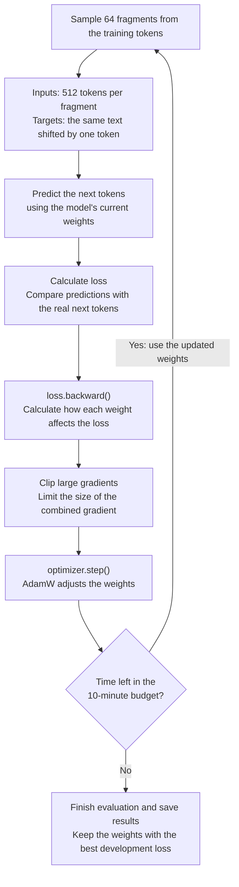

# 2. Pretraining

In this tutorial, you will train **ScratchGPT-30M**, a small language model with roughly 30 million parameters, on **Wolne Lektury**. It starts with random weights and learns to predict the next token. By the end, you will compare its text before and after training and know where its saved weights are.

This model learns to continue text. It is not trained to answer chat questions.

<details>
<summary style="color: #8b1e2d; font-size: 1.15em; cursor: pointer;"><strong>Click to expand: What actually changes during training?</strong></summary>

**Watch the explanation** — 3 min 57 s, English narration and on-screen captions.

**This video has sound.** Click the speaker icon to unmute; you may want to use headphones.

https://github.com/user-attachments/assets/07683947-1b8d-4cf9-b16a-c78bdadb5eb5

[Download the video](assets/videos/wolne-lektury-training.mp4).

**The model's parameters change.** Parameters, often called weights, are numbers used in the model's calculations. Our ScratchGPT-30M has roughly 30 million of them. Its main weight matrices start with random numbers, so it has not yet learned Polish. Training adjusts these numbers to make better predictions.

**The books supply the correct answers.** We use the Wolne Lektury texts prepared in the previous step. The provided tokenizer has already converted them into token IDs. Its vocabulary of 8,192 tokens stays fixed during this exercise.

Here is a short illustration using the same tokenizer. This is an example sentence, not a quotation from the training books. `_` marks a space in this example:

```text
Text:    Ala ma kota.
Tokens:  A | la | _ma | _ko | ta | .
Input:   A | la | _ma | _ko | ta
Target:  la | _ma | _ko | ta | .
```

The target is the same sequence shifted by one token. After seeing `A`, the model should predict `la`. After seeing `A | la`, it should predict `_ma`. At each position, it can use only the tokens up to that position. It cannot peek at the next token.

**One training step in our default Wolne Lektury run:**

1. Pick **64 random text fragments** from the training data. This group is a *batch*. Each fragment supplies 512 input tokens and their next-token targets.
2. Feed the inputs through the model's **eight transformer layers**. These layers combine information from earlier tokens. At each position, the model assigns probabilities to all **8,192 possible next tokens**.
3. Compare those probabilities with the real next tokens. The average error score is called **loss**. Giving the correct token a very low probability produces a larger loss. This batch supplies **64 × 512 = 32,768 predictions** to learn from.
4. Calculate how each parameter affects that loss. This is *backpropagation*. The **AdamW optimizer** uses those calculations to make small adjustments to the parameters.
5. Repeat with another batch, until the **ten-minute training budget** runs out.

The model learns patterns that help it continue literary text: spelling, grammar and common phrases. This does not guarantee sensible or factual writing.

**What you see in the visualization:** the loss curve records prediction errors during training. At checkpoints—saved stages of training—the script also generates continuations of the same prompts. These show how the output changes. Generating these previews does not update the weights; learning happens in the training steps above.

</details>

## 1. Check that you are ready

Complete [data preparation](01-data-and-tokens.md#prepare-wolne-lektury) and wait for **Ready**. Run the commands below from the repository's root folder, where `README.md` is located.

Training runs on a cloud GPU in Modal. Your laptop launches the job and displays its progress; it does not need its own GPU.

Allow roughly **12 minutes**, plus any initial environment build. The training loop has a **10-minute budget**; loading, evaluation and saving take extra time. A previous default run took 11 min 32 s and cost about **$0.78 in worker compute**, with its environment already built. This is an example, not a spending cap; builds and storage are separate.

## 2. Start training

Run:

```bash
modal run scripts/scratch_recipe_modal.py --recipe wolne-lektury
```

The command will:

1. Start the Modal worker and load the prepared data.
2. Evaluate the random model and save some initial text samples.
3. Train, reporting loss and periodically generating new samples.
4. Select the weights with the best development loss, evaluate them, and save the results.

Startup can take time before the first training measurements appear. At the end, the terminal prints **`Saved`** followed by your local run folder.

Keep this terminal connected until the command finishes. You only need to launch it once.

The `wolne-lektury` recipe chooses the settings for you: **ScratchGPT-30M, H100 GPU, batch size 64 and a 512-token context**. It uses the prepared Wolne Lektury data and the saved 8,192-token tokenizer. Keep these defaults for your first run.

<details>
<summary style="color: #8b1e2d; font-size: 1.15em; cursor: pointer;"><strong>Click to expand: How does the training script work? A programmer's overview</strong></summary>

[scratch_recipe_modal.py](scripts/scratch_recipe_modal.py) is the **job launcher**. It reads the `wolne-lektury` recipe, chooses the GPU and settings, and asks Modal to run the training code in the cloud.

**Inside `train_scratch.py`, one training step looks like this:**



The input/target shift supplies the answers automatically. For example, after `A | la`, the target is `_ma`. **The weight update is the learning step.** The next batch uses those updated weights. Before each step, `optimizer.zero_grad()` clears the previous gradients so they do not accumulate.

Periodically, the script also checks development loss and saves better weights to `best.pt`. Those checks do not update weights; they help choose which model version to keep.

**The libraries have different jobs:**

- **Modal** supplies the remote computer, its Python environment and persistent storage.
- **PyTorch (`torch`)** runs the model and learns its weights. `loss.backward()` calculates gradients; `optimizer.step()` applies an AdamW update.
- **NumPy** reads the prepared token arrays and samples text fragments.
- **Hugging Face Tokenizers (`tokenizers`)** loads the fixed tokenizer and converts between text and token IDs for the generated examples.

**Follow the calls:** the launcher's local `main()` starts a remote worker. `execute_recipe()` passes the settings to [scratch_worker.py](scripts/scratch_worker.py), which calls `run()` in [train_scratch.py](scripts/train_scratch.py). The model is defined in [scratch_model.py](scripts/scratch_model.py).

During training, development checks keep track of the best weights, and [training_progress.py](scripts/training_progress.py) streams progress to your laptop. At the end, the selected model is evaluated and its results are downloaded. The weights stay in Modal until you download them separately.

</details>

<details>
<summary style="color: #8b1e2d; font-size: 1.15em; cursor: pointer;"><strong>Click to expand: What do these settings mean?</strong></summary>

For our default Wolne Lektury run:

- **Parameters (weights):** adjustable numbers inside the model. ScratchGPT-30M has roughly **30 million**. Training changes them; this number is not the number of books or tokens.
- **Random weights:** the starting point before learning. The main weight matrices begin with random values, rather than knowledge from a pretrained model.
- **Context — 512 tokens:** the length of each input fragment. To predict the next token at a position, the model can use only the tokens up to that position, not later ones. A token can be part of a word, so 512 tokens does not mean 512 words.
- **Batch size — 64:** how many fragments are used together for one training update. With 512 positions per fragment, that is **32,768 next-token predictions** before one weight update.
- **Checkpoint:** a saved model version from a particular stage of training. We keep the weights with the best development loss in `best.pt`. The viewer also records progress and sample text at checkpoints; those records are not themselves the model weights.
- **Loss:** a prediction-error score. It is lower when the model gives the real next tokens higher probabilities. Training loss measures practice performance; development loss measures performance on separate texts.
- **Nats:** the unit used for this loss, because its calculation uses the natural logarithm. You do not need the formula to read the graph: lower is better when comparing runs on the same data and tokenizer.

</details>

<details>
<summary style="color: #8b1e2d; font-size: 1.15em; cursor: pointer;"><strong>Click to expand: What does choosing a GPU change?</strong></summary>

A **GPU** is hardware that performs many numerical calculations in parallel. Training uses it to calculate predictions and weight updates. H100, L4 and A10 are different GPU models, not different language models.

GPUs differ in speed, available memory and price. Memory limits how large a model and batch can fit. With our fixed ten-minute budget, a faster GPU can usually process more batches and make more weight updates. A cheaper GPU may cost less for the run but complete fewer updates.

**Keep H100 for this walkthrough.** You do not need to compare GPUs to complete it. Knowing the trade-off is useful later when choosing between a lower run cost and more training within the same time. More updates do not guarantee a better model; check development loss and generated text.

[Optional GPU comparisons](additional/pretraining-experiments.md#comparing-gpus).

</details>

## 3. Watch your run

If the viewer is not already running, open a second terminal in the same repository and run:

```bash
pnpm dev
```

Keep the viewer terminal running. In your browser, open [http://localhost:5173/#pretrain](http://localhost:5173/#pretrain). This opens **Pretraining**. If you already have the viewer open, select **Pretraining** in that tab instead.

Choose **your run** from the **Run** menu. Entries labelled **Example run** are included demonstrations, not the job you just started.

Watch two things:

- **Development loss:** a prediction-error score on text excluded from weight updates. A downward trend means the model is getting better at predicting that separate text. Individual measurements can fluctuate.
- **Generated text:** select different checkpoints to compare continuations of the same prompt. Early output may look like nonsense; later output should become more recognizable as Polish prose.

Training loss measures performance on the batches the model learns from. Development loss helps you check whether that learning also works on other text. You do not need a particular loss value to complete this tutorial.

Hover over generated tokens to see their probabilities and alternatives. Generating these previews does not update the model's weights.

## 4. Check the finished result

Wait for the training command to finish and print **`Saved`**. In the viewer, compare the initial output with the **Selected checkpoint**. This is the model version chosen using development loss; it is not necessarily the last training step.

Use the same prompt for both versions. Look for more recognizable words and sentences, then check whether the selected model's development and test loss improved over the random model. Test loss assesses the selected model on a separate set of texts; it does not choose the checkpoint.

For example, an earlier Wolne Lektury run produced these excerpts:

| Starting text | Before training | After training |
|---|---|---|
| — Nie wiem, | 99okraty Juni Griiennikózózniemie… | ale mówiła o pani zaraz. … |

Your wording and scores will differ. More recognizable prose is useful progress, but the model can still make grammatical mistakes or produce nonsense. It is not a reliable source of facts.

## 5. Find your saved model

The **`Saved`** message identifies a folder such as `runs/scratch-wolne-lektury-30m-<number>/` on your laptop. That folder contains downloaded measurements and generated samples for the viewer.

The actual **model weights stay in Modal**, in the `model-training-workshop` volume, under `runs/<run-name>/`. The worker calls that location `/persist/runs/<run-name>/`.

- `best.pt` contains the selected model's learned weights.
- `result.json` includes the model configuration and evaluation results.
- `tokenizer.json` contains the matching tokenizer.

The reports let you inspect what happened. To generate new text, you also need the weights and matching tokenizer.

## Optional: try your own starting phrase

The viewer's **Next-token prediction** panel runs a saved model locally on your laptop's CPU. It needs the three files above in the same local run folder. The training command already downloaded `result.json` and `tokenizer.json`; download `best.pt` once after the run finishes.

In your terminal, set `RUN_NAME` to the exact folder name printed after training. Replace the placeholder below; do not include the leading `runs/`:

```bash
RUN_NAME="YOUR_RUN_FOLDER_NAME"
modal volume get model-training-workshop "runs/$RUN_NAME/best.pt" "runs/$RUN_NAME/best.pt"
```

This downloads the saved weights, not the training dataset, and does not start another training job. [Modal's file download documentation](https://modal.com/docs/cli/latest/volume#modal-volume-get).

Refresh the viewer, then:

1. At the top of **Pretraining**, choose the downloaded model in **Next-token prediction**.
2. Enter a short Polish starting phrase in **Input**, such as `Pewnego dnia`.
3. Click **Next token** several times to build a continuation. You can also click a candidate to choose that token yourself.
4. Use **Reset** to clear the continuation and try again.

Leave **Temperature** at its default initially. Lower values favor the most likely tokens; higher values spread probability more widely. These actions use the saved weights without changing them. This is **inference**, not training.

If the panel says **No local model weights**, check that `best.pt`, `result.json` and `tokenizer.json` are together inside the same `runs/scratch-.../` folder.

## You have finished pretraining

You have completed this part when your run has finished, you have compared its initial and selected outputs, and you know where the model is saved. Trying a new prompt is optional.

**Next:** [3. Supervised fine-tuning](03-fine-tuning.md).

**Optional reading:** [GPU comparisons, training duration and Wikipedia experiments](additional/pretraining-experiments.md). These are outside the main workshop path.

**Further reading:** [Language models](README.md#language-models).
