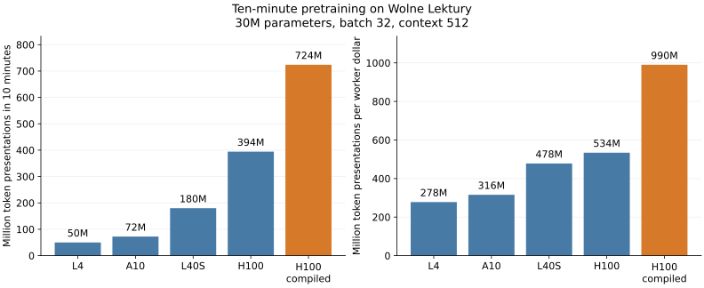

# 2. Pretraining

Train a **30-million-parameter generative pretrained transformer (GPT)** from random weights on Wolne Lektury. It learns next-token prediction, not how to answer chat questions.

## What to expect

| Dataset / model | Training | End to end | GPU | Worker cost | Test loss before → after |
|---|---:|---:|---|---:|---:|
| Wolne Lektury / ScratchGPT-30M | 10 min | 11 min 32 s | H100 | $0.78 | 9.073 → 2.820 |

Measured in the [flow check](results/workshop-check.html), with the image already built. Costs include worker CPU/memory, exclude builds/storage, and are estimates. Results vary.


## Run

Complete [data preparation](01-data-and-tokens.md#prepare-wolne-lektury) first, then run:

```bash
modal run scripts/scratch_recipe_modal.py --recipe wolne-lektury
```

Up to **10 minutes training / about $0.78 measured worker compute**. Loading and evaluation add time; builds/storage cost extra. Context: 512 tokens; vocabulary: 8,192 tokens. You can start [fine-tuning](03-fine-tuning.md) in another terminal while this runs; each GPU job is billed separately.

## Watch and open

The terminal prints training loss and checkpoint evaluations. Lower loss means better next-token predictions. **While training runs, open another terminal** in this repository and run:

```bash
uv run scripts/view_results.py pretrain
```

The live chart refreshes every three seconds. Training-loss points arrive about every five seconds; development loss is checked about once a minute. After training, the same view opens the completed report with before/after text. Development loss chooses the checkpoint; test loss evaluates it separately.

To inspect an included result while waiting:

```bash
uv run scripts/view_results.py pretrain --example
```

## Actual result

**ScratchGPT-30M**, random → pretrained on the historical Wolne Lektury corpus, ten-minute run `scratch-wl-30m-1788883120289174941`. Literal opening excerpts of generated continuations; ellipses mark truncation.

| Input | Random model | After pretraining |
|---|---|---|
| — Nie wiem, | 99okraty Juni Griiennikózózniemie… | ale mówiła o pani zaraz. … |
| Test loss (lower is better) | 9.073 | 2.782 |

The [latest flow check](results/workshop-check.html) took 11 minutes 32 seconds including loading and evaluation, with test loss **9.073 → 2.820**.

The full report preserves unedited continuations. The model learned recognizable prose but still makes grammatical and logical mistakes.

## Choosing a GPU

Measured on Wolne Lektury: the same 30M model, batch 32, context 512 and ten-minute training budget.

| GPU | Tokens processed | Worker cost | Test loss after training |
|---|---:|---:|---:|
| L4 | 50M | $0.18 | 3.152 |
| A10 | 72M | $0.23 | 3.064 |
| L40S | 180M | $0.38 | 2.885 |
| H100 | 394M | $0.74 | 2.784 |
| H100, compiled training | 724M | $0.73 | 2.748 |

H100 processed more tokens per dollar in this comparison. Compilation speeds up the training loop; its initial compilation time is included in the ten minutes. These research runs omit the workshop worker's extra quality diagnostics.

To compare cards, use the same batch size on both runs:

```bash
modal run scripts/scratch_recipe_modal.py --gpu L4 --batch-size 32
modal run scripts/scratch_recipe_modal.py --gpu H100 --batch-size 32
```

Add `--compile-training` to try compiled training. The complete participant command with batch 32 was also tested: 578M token presentations, test loss 2.760, 11 min 4 s worker time, $0.77. A larger GPU can also fit larger models or batches; speed and memory requirements depend on the workload. [Modal GPU options](https://modal.com/docs/guide/gpu) and [pricing](https://modal.com/pricing). [Measured comparisons](results/training-comparisons.html).



## Tokens and epochs

The measured ten-minute run processed **328M token presentations**, about **3.24 times** the 101M-token training corpus. We sample random windows, so this is approximate exposure, not three sequential passes. More training can lower training loss while making held-out loss worse; watch both curves. In the matched research runs, extending training from 10 to 30 minutes increased exposure from 3.89 to 12.44 corpus-equivalents and reduced test loss from 2.784 to 2.720; worker cost rose from $0.74 to $2.12.

For Wikipedia, the training pool is much larger: 3.14B tokens. A ten-minute 30M/H100 research run processed 404M tokens, only **0.13 corpus-equivalents**. At that measured rate, one equivalent would take roughly **78 minutes / $5.8** (an extrapolation, not a measured full pass). A useful learning demonstration does not require a complete epoch.

## Try

For a shorter run, add `--max-seconds 300`. Compare the generated text and test loss, not just the training loss. Each run saves a new folder under `runs/`; the view command opens the latest completed run.

## Wikipedia alternative

[September 2026 dump](https://dumps.wikimedia.org/plwiki/20260901/): **2.73 GB compressed**, original markup retained. Preparation runs on Modal CPU and needs considerably more time and cloud storage than Wolne Lektury.

Earlier measured runs on the prepared Wikipedia corpus (L4, context 256):

| Model | Training | Worker time | Worker cost | Test loss before → after |
|---|---:|---:|---:|---:|
| ScratchGPT-10M | 5 min | 5 min 51 s | $0.10 | 9.063 → 2.285 |
| ScratchGPT-30M | 5 min | 5 min 52 s | $0.10 | 9.081 → 2.400 |

Preparation is separate; these are historical measurements, not a fresh-download timing. Both learned markup while inventing facts. [Recorded results](results/pretraining-results.html).

Prepare it:

```bash
modal run scripts/prepare_data_modal.py --corpus wikipedia
```

After **Ready**, train for five minutes, about **$0.10 measured worker compute**:

```bash
modal run scripts/scratch_modal.py --size 10m --max-seconds 300
```

Repeat with `--size 30m` to compare sizes. Both use a 256-token context. Open with the same `view_results.py pretrain` command.

**Next:** [3. Supervised fine-tuning](03-fine-tuning.md).
