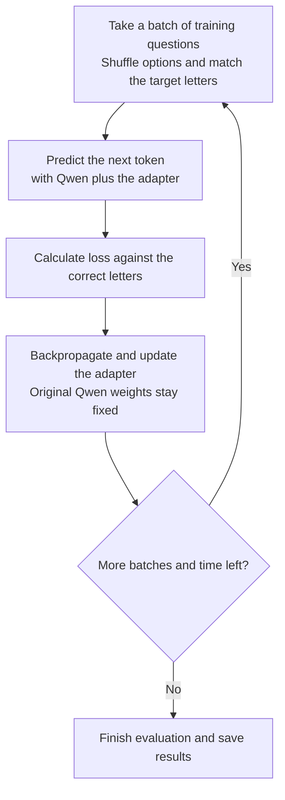

# 3. Supervised fine-tuning: Polish driving-test answers

You will teach a model to choose **A, B or C** for Polish driving-theory questions. This is **supervised fine-tuning (SFT)**: learning from examples with supplied correct answers.

We now use **Qwen3.5-0.8B**, an existing pretrained model with roughly 800 million parameters. **This does not continue training your Wolne Lektury model.** Qwen already has language skills; we adapt it to this specific task.

<details>
<summary style="color: #8b1e2d; font-size: 1.15em; cursor: pointer;"><strong>Click to expand: Why aren't we using the model we just trained?</strong></summary>

Chapter 2 showed how a model begins learning language from random weights. Our small model had only ten minutes to learn from literary text. It can continue text, but it has not been trained to follow question-answering instructions.

Qwen gives us a stronger starting point for this exercise. We can spend our short training budget adapting its existing skills to driving-test answers. These chapters show two useful choices: build a model from scratch, or adapt an existing one. You could also fine-tune your own model, but that is a separate experiment.

</details>

## 1. Understand the task and check you are ready

Use the same repository and Modal setup as before. You do not need to finish the pretraining run or download its weights. The [question dataset](datasets/prawko-v2/data.json) is already included. The script loads Qwen and its tokenizer automatically on the Modal worker.

Each example contains a question, three options and the correct letter. For example, an abbreviated translation of dataset question 10840 asks how to transport a child under 150 cm in the front passenger seat. Option B describes a child seat or other child restraint; the supplied target is **B**. Training uses the complete Polish question and options.

The model learns to predict **the answer letter**, not an explanation. The script shuffles option order during training and updates the target letter to match.

<details>
<summary style="color: #8b1e2d; font-size: 1.15em; cursor: pointer;"><strong>Click to expand: How is answering a question still predicting the next token?</strong></summary>

The question and its options are the text the model reads first. Its answer is the continuation. Here is training question 2536, with the answer boundary shown as `Answer:` for clarity:

```text
Kierujesz samochodem osobowym podczas ulewnego deszczu. Którą z wymienionych czynności należy wykonać po wjechaniu w koleinę wypełnioną wodą?
A. Płynnie zmniejszyć prędkość.
B. Zdecydowanie przyhamować.
C. Zdecydowanie przyspieszyć.
Answer:
```

The supplied target is `A`. The script uses Qwen's chat formatting to mark where the answer starts; it does not literally add the English label above. It asks the model to return only one letter.

In chapter 2, we learned from next-token predictions throughout a passage. Here, the question provides context and the training loss focuses on the correct answer letter. If the model gives `A` a low probability, the loss is higher. Updating the adapter aims to make that correct letter more likely.

</details>

<details>
<summary style="color: #8b1e2d; font-size: 1.15em; cursor: pointer;"><strong>Click to expand: Why shuffle the answer options?</strong></summary>

In the example above, the correct answer occupies position A. If we move that answer to position C, the target must become `C`.

Shuffling discourages a shortcut: remembering that a particular question always means "A". The model should connect the question to the answer's content wherever it appears. This does not guarantee understanding, but it reduces reliance on a fixed option order.

</details>

An **adapter** is a small set of extra trainable weights added to the existing model.

<details>
<summary style="color: #8b1e2d; font-size: 1.15em; cursor: pointer;"><strong>Click to expand: If the original weights stay frozen, how can the answer change?</strong></summary>

Frozen means those original numbers are not updated. The adapter adds a learned adjustment to some of the model's calculations. The combined result affects the probabilities of the next token.

For example, the original model might favor `B`. After training, the adapter's adjustments may make `A` more likely for the same question. We changed the extra weights that participate in the calculation, so the answer can change even though the original weights stayed fixed.

</details>

There are **100 training questions**, **25 development questions** and **40 test questions**. Training questions update the adapter. Development questions select the best checkpoint. Test questions measure the selected model.

<details>
<summary style="color: #8b1e2d; font-size: 1.15em; cursor: pointer;"><strong>Click to expand: What changes during fine-tuning?</strong></summary>

In pretraining, we started with random model weights. Here, we start with pretrained weights and keep them fixed. **LoRA** adds small trainable matrices, called an **adapter**, to parts of the model. Only these additions learn during this workshop.

The original model and adapter work together to produce predictions. Updating the adapter requires less training memory than updating all the original weights. To use the result later, you need **both the original Qwen model and your saved adapter**.

For each training question, the model predicts the next token. The correct letter supplies the target. Loss measures how poorly the model predicts that letter; the optimizer adjusts the adapter to reduce that loss.

</details>

## 2. Start fine-tuning

Run from the repository directory:

```bash
modal run scripts/prawko_modal.py --method sft --epochs 10 --max-seconds 180
```

The command will:

1. Start a Modal worker and load the pretrained model and included questions.
2. Evaluate the original model to establish a before-training score.
3. Train a LoRA adapter and check development performance.
4. Select the best checkpoint using development results, evaluate it, and download reports.

Keep the terminal connected. At the end, it prints **`Saved`** followed by your local run folder. Loading and evaluation take extra time beyond the training budget. Model loading and the initial evaluation can take time before the first training measurements appear. Keep the terminal open while you wait.

Keep the defaults for your first run: **Qwen3.5-0.8B on one L4 GPU**. The GPU provides the memory and parallel computation needed for training; you do not need a GPU on your laptop.

<details>
<summary style="color: #8b1e2d; font-size: 1.15em; cursor: pointer;"><strong>Click to expand: What do these settings mean?</strong></summary>

- **`--method sft`:** learn from the supplied correct answer for each question.
- **`--epochs 10`:** make at most ten passes through the training questions. An epoch is one pass, not one weight update.
- **`--max-seconds 180`:** stop the training loop after roughly three minutes, even if ten epochs are not complete. Setup and final evaluation are separate, so the whole command takes longer.
- **Batch size — 4:** process four questions together before one adapter update.
- **Learning rate — `5e-5`:** controls the size of optimizer updates. Keep the default for this walkthrough.
- **Checkpoint:** a saved adapter version. This script selects by development accuracy, using the average probability of correct answers to break ties. The final version is not necessarily the selected version.

</details>

<details>
<summary style="color: #8b1e2d; font-size: 1.15em; cursor: pointer;"><strong>Click to expand: How does the training script work? A programmer's overview</strong></summary>

[prawko_modal.py](scripts/prawko_modal.py) launches the cloud job and downloads reports. [prawko.py](scripts/prawko.py) contains the training loop.



The script also checks development questions after each full or partial epoch, keeping the best adapter. These checks do not update weights.

**Transformers** loads the model and tokenizer. **PEFT** adds and saves the LoRA adapter. **PyTorch** calculates predictions, gradients and AdamW updates. **Modal** supplies the remote GPU and persistent storage. Progress is streamed to the local viewer.

</details>

## 3. Watch your run

In another terminal in the repository, run:

```bash
pnpm dev
```

Open the address printed in the terminal, usually [http://localhost:5173](http://localhost:5173). If the viewer is already running, keep using it. Open **SFT** and select **your run**, rather than an included **Example run**.

Inspect a training question and its target letter. Then compare A/B/C probabilities on development questions across checkpoints. A higher probability for the correct option means the model favors that answer more strongly; it may still favor a wrong option overall.

Watch **development accuracy**: the fraction of the 25 separate questions answered correctly. It can fluctuate. Development checks select the adapter to keep; the test score is reported separately.

## 4. Check the finished result

Wait for **`Saved`**. At the top of the viewer, find **Test answers**. It shows the original model’s score followed by the development-selected checkpoint’s score on the **40 test questions**. Each additional correct answer changes accuracy by 2.5 percentage points.

An earlier run improved from **21/40 to 27/40**. This is an example, not a required score. Your result may differ, and some previously correct answers may become wrong.

The before/after examples below the graph are **development questions**, not test questions. Select **Selected checkpoint** and inspect one answer that changed. Compare the predicted letter with the supplied answer key. If no answer changed, inspect one incorrect answer and its before/after probabilities instead. The goal is to understand the result, not reach a particular benchmark.

[Earlier before/after answers](results/prawko-example-results.md) provide examples for comparison; they are not your live run.

## 5. Find your saved adapter

The terminal identifies a local folder such as **`runs/prawko-sft-<number>/`**. It contains reports, measurements and recorded answers for the viewer.

The learned adapter stays in the **`model-training-workshop` Modal volume**, under `runs/<run-name>/adapter/`. The worker sees this as `/persist/runs/<run-name>/adapter/`. The same run contains `final_adapter/` for the last training version and `tokenizer/` for the tokenizer.

The selected `adapter/` is what you would load alongside the original Qwen3.5-0.8B model to use your fine-tuned model. The downloaded reports alone cannot generate new answers.

## You have finished fine-tuning

You have finished when the command has completed, you have compared before/after test results, and you can explain which parts of the model changed.

## Optional exercise: try your own question

Use your saved adapter to answer a new Polish question. Supply three answer options; the model will choose A, B or C.

Copy the folder name from the training command's **`Saved`** message. Replace `YOUR_SFT_RUN_NAME` below with that name, such as `prawko-sft-123456789`. Do not include `runs/`.

```bash
modal run scripts/try_adapter_modal.py --task exam --run YOUR_SFT_RUN_NAME \
  --question "Jaki kolor sygnalizacji świetlnej oznacza nakaz zatrzymania?" \
  --a "Czerwony." \
  --b "Zielony." \
  --c "Każdy kolor oznacza to samo."
```

The command prints **Answer** and probabilities among A/B/C. For this example, the expected answer is A. Replace the question and all three options with your own. You do not supply the correct letter to the model; check its prediction yourself. It can be wrong, and these probabilities are not a guarantee of correctness.

This loads the original model and your selected adapter from Modal storage onto an L4 GPU. **It incurs cloud inference charges**, including model-loading time, but does not train or change the adapter. No manual download is needed. Loading can take time; the answer appears in the terminal, not the visualization.

The helper uses the same A/B/C selection as the workshop evaluation. It does not generate explanations. See [the inference script](scripts/try_adapter_modal.py) for how the model and adapter are loaded.

<details>
<summary style="color: #8b1e2d; font-size: 1.15em; cursor: pointer;"><strong>Click to expand: Optional alternative — run on a Mac</strong></summary>

On a Mac with a supported Apple GPU, you can run locally instead of using Modal:

```bash
uv run scripts/prawko.py --device mps --precision bfloat16 --method sft --max-seconds 180 --epochs 10
```

This downloads the pretrained model to your Mac and uses local memory and compute. Results appear under **SFT** when the run finishes. The adapter and reports are saved locally in the output folder printed by the script. [Mac experiment results](results/macos-fine-tuning.md).

</details>

**Next:** [4. Reinforcement learning with verifiable rewards](04-reinforcement-learning.md).

**Optional reading:** [More data, longer runs, GPU choices and SFT/RLVR comparisons](additional/fine-tuning-experiments.md).

**Further reading:** [Fine-tuning and reinforcement learning](README.md#fine-tuning-and-reinforcement-learning).
