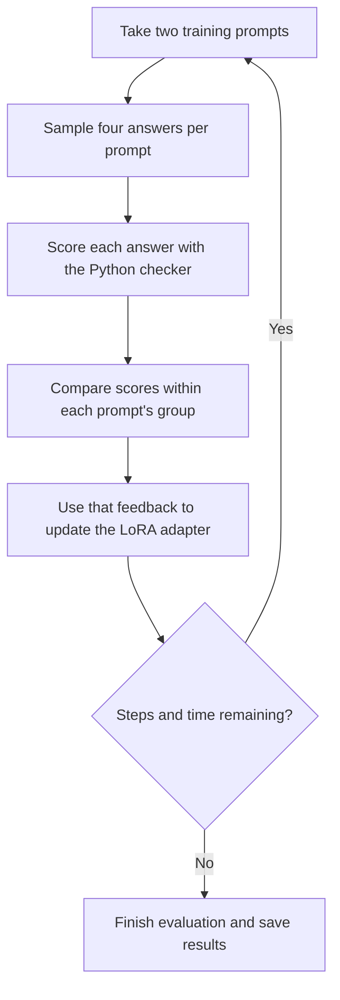

# 4. Reinforcement learning with verifiable rewards: six words

In fine-tuning, we supplied correct answers. Here, the model generates answers and a **Python checker scores them**. Training uses those scores to change the model's behavior. This is **reinforcement learning with verifiable rewards (RLVR)**.

We start from **Qwen3.5-4B**, a pretrained model with roughly four billion parameters. **We do not continue training the driving-exam adapter from chapter 3.** This is a new task and a separate run, again using LoRA to keep the original model weights fixed.

## 1. Understand the task and check you are ready

The task is to write one line with **exactly six English words**, including two requested words, with **no repeated words**. Return only the story, without a title or explanation.

For the requested words **astronaut** and **birthday**:

| Answer | Check |
|---|---|
| Astronaut blew birthday candles. | Four words: fails. |
| Astronaut blew birthday candles in space. | Six words, both requested words, no repeats: passes. |

The checker counts sequences of letters as words and ignores capitalization when matching them. Punctuation does not count as a word.

<details>
<summary style="color: #8b1e2d; font-size: 1.15em; cursor: pointer;"><strong>Click to expand: Why can a model with four billion parameters struggle to count six words?</strong></summary>

Remember chapter 1: the model generates **tokens**, while this checker counts **words**. A word can take several tokens. Generating six tokens therefore does not necessarily produce six words.

The model chooses each next token using learned patterns. Fluent writing does not guarantee that it will track the word count, include both requested words and stop at exactly the right point. A larger model can still miss these constraints. This exercise gives it training feedback specifically about those rules.

</details>

Use the same repository and Modal setup as before. There is no dataset to download manually: the script generates **256 training prompts**, **24 development prompts** and **32 test prompts**. It loads the pretrained model automatically. There are no supplied target stories.

<details>
<summary style="color: #8b1e2d; font-size: 1.15em; cursor: pointer;"><strong>Click to expand: Why use reinforcement learning instead of supplying correct stories?</strong></summary>

Many different stories can satisfy the same request. We could write target stories and use supervised fine-tuning, as in chapter 3. But writing those examples takes work, while checking word counts and required words is easy to automate.

Here, the model proposes answers and the checker supplies feedback. We do not need to write a target story for every prompt. This is useful when we can reliably check the property we want to teach. It also sets a limit: our checker can teach compliance with these rules, but it cannot tell the model which story is more interesting.

</details>

<details>
<summary style="color: #8b1e2d; font-size: 1.15em; cursor: pointer;"><strong>Click to expand: How can a score teach the model?</strong></summary>

**Watch: How can a score teach Qwen to write six words?** — 4 min 32 s, English question-and-answer narration, no subtitles.

**This video has sound.** Click the speaker icon to unmute; you may want to use headphones.

https://github.com/user-attachments/assets/2a32743a-e792-48dc-911b-8bb65d1d2f8d

[Download the full-quality video](assets/videos/qwen-six-words-rlvr.mp4).

For each training prompt, the model samples four possible answers. The checker scores each one. The training update encourages answers that scored better than their alternatives and discourages those that scored worse. Only the LoRA adapter changes.

**Reward** is a number from 0 to 1. The six-word checker gives partial credit for getting close to six words, including the requested words, and avoiding repetitions while using the required format. Meeting every rule adds a bonus and gives the maximum reward of 1.

Imagine these four sampled answers for the requested words **astronaut** and **birthday**. These are teaching examples, with rewards calculated by the actual checker and rounded to two decimal places:

| Sampled answer | Reward | Why? |
|---|---:|---|
| Astronaut blew birthday candles in space. | 1.00 | Meets every rule. |
| Astronaut blew birthday candles. | 0.43 | Includes both words, but has only four words. |
| Astronaut watched distant stars in silence. | 0.40 | Six words, but missing "birthday". |
| Astronaut astronaut birthday birthday candles candles. | 0.40 | Six words and both requested words, but repeats words. |

The script compares each answer's score with the average score of the other three answers for that prompt. In this example, the passing answer scores above its alternatives; the other answers score below theirs. The training objective pushes up the probability of the token choices in the better-scoring answer and pushes down those in the worse-scoring answers. The optimizer uses gradients to adjust the adapter, much as it did in chapter 3. Shared patterns can then affect answers to other prompts too; improvement is not guaranteed for every answer.

The checker itself only returns a score. We do not calculate gradients through its word-counting code. Instead, that score determines the direction and strength of the learning signal applied to the model's token probabilities. The actual script also applies a small penalty for moving too far from the original model, so rewards are not its only consideration.

**Success** is a separate yes/no check: did the answer meet every rule? Average reward can improve even while some answers still fail.

The checker does not judge whether a story is interesting or makes sense. A dull or nonsensical answer can pass. Training follows what we score.

</details>

## 2. Start reinforcement learning

Run from the repository directory:

```bash
modal run scripts/rlvr_showcase_modal.py --task six_words
```

The command will:

1. Start a Modal worker, load Qwen and generate the prompt sets.
2. Evaluate the original model to record its starting performance.
3. Generate training answers, score them and update a LoRA adapter.
4. Select a checkpoint using development results, evaluate it, and download reports.

Keep the terminal connected until it prints **`Saved:`** followed by your local run folder. Model loading and the initial evaluation can take time before the first training measurements appear. Keep the terminal open while you wait.

The defaults use **one L4 GPU**, at most **160 training steps**, and a training-loop budget of roughly **ten minutes**. Training stops when either limit is reached. Loading and evaluation add time, so the full command takes longer. You do not need a GPU on your laptop.

<details>
<summary style="color: #8b1e2d; font-size: 1.15em; cursor: pointer;"><strong>Click to expand: How does the training script work? A programmer's overview</strong></summary>

[rlvr_showcase_modal.py](scripts/rlvr_showcase_modal.py) launches the cloud job and downloads reports. [rlvr_showcase.py](scripts/rlvr_showcase.py) trains the adapter. [rlvr_tasks.py](scripts/rlvr_tasks.py) generates prompts and checks answers.



The update uses each answer's score relative to its alternatives, with a small penalty for moving too far from the original model's behavior. If there is no learning signal, an update can be skipped. We do not simply save the best generated story as a target answer.

Every 20 steps, the script checks development prompts without learning from them. It keeps the adapter with the most development successes, breaking ties with average reward. The original version can remain selected if training does not improve that score.

**Transformers** loads the model and tokenizer. **PEFT** manages LoRA. **PyTorch** generates answers and calculates gradients and AdamW updates. **Modal** provides the GPU and persistent storage. The reward checker is ordinary Python code.

</details>

## 3. Watch your run

In another terminal in the repository, run:

```bash
pnpm dev
```

Open the address printed in the terminal, usually [http://localhost:5173](http://localhost:5173). If the viewer is already running, keep using it. Open **RLVR** and select **your run**, rather than an included **Example run**.

Look at a training prompt, its sampled answers and their rewards. Count the words in one answer and check whether both requested words appear. Use the rules above to understand its score.

Then select checkpoints to compare answers to the same development prompts. These checks help select the adapter to keep; they do not update it. Training rewards may fluctuate because the model samples different answers.

## 4. Check the finished result

Wait for **`Saved:`**. At the top of the viewer, find **Test constraints**. It shows the original model’s score followed by the development-selected checkpoint’s score on the **32 separate test prompts**. Test success counts answers that pass every rule, not just answers with some partial reward.

An earlier run improved from **1/32 to 24/32**. This is an example, not a required score. Your results may differ. [Earlier run report](http://localhost:5173/reports#workshop-check.html) and [recorded before/after answers](http://localhost:5173/reports#rlvr-results.html) show past runs, not your current job.

The before/after examples below the graph are **development prompts**, not test prompts. Select **Selected checkpoint** and inspect one before/after answer for the same prompt. Identify which rule it learned to satisfy, or which rule it still fails. Then read a passing answer: is it actually an interesting story?

**Passing the checker does not guarantee good writing.** This is the main lesson: the reward defines what training encourages.

## 5. Find your saved adapter

The terminal identifies a local folder such as **`runs/rlvr-train-six_words-<number>/`**. It contains reports, recorded answers and training measurements for the viewer.

The selected adapter stays in the **`model-training-workshop` Modal volume**, under `runs/<run-name>/adapter/`. The worker sees this as `/persist/runs/<run-name>/adapter/`. The tokenizer is saved alongside it in `tokenizer/`.

To use the trained model later, you need **the original Qwen3.5-4B model plus this adapter**. Local reports alone cannot generate new stories.

## You have finished reinforcement learning

You have finished when the command has completed, you have compared before/after answers, and you can explain the difference between receiving partial reward and passing every rule.

## Optional exercise: try your own words

Use your saved adapter to write a story containing two words you choose.

Copy the folder name from the training command's **`Saved:`** message. Replace `YOUR_RLVR_RUN_NAME` below with that name, such as `rlvr-train-six_words-123456789`. Do not include `runs/`.

```bash
modal run scripts/try_adapter_modal.py --task six_words --run YOUR_RLVR_RUN_NAME \
  --word-one lantern --word-two river
```

Replace `lantern` and `river` with two different English words, using letters only. The command prints the generated story, its word count, reward and **Pass/Fail** result from the same checker used during training.

Count the words yourself. Did the answer include both requested words without repetitions? Is it an interesting story? A failed answer is a useful result too: training does not guarantee success on a new prompt.

This loads the original model and your selected adapter from Modal storage onto an L4 GPU. **It incurs cloud inference charges**, including model-loading time, but does not train or change the adapter. No manual download is needed. Loading can take time; the answer appears in the terminal, not the visualization.

The helper uses deterministic generation, as in the workshop evaluation. Repeating the same input is expected to give the same answer. Try a different word pair to explore the result. See [the inference script](scripts/try_adapter_modal.py).

**Optional reading:** [Countdown and what a reward can accidentally teach](additional/reinforcement-learning-experiments.md).

**Further reading:** [Fine-tuning and reinforcement learning](README.md#fine-tuning-and-reinforcement-learning).
