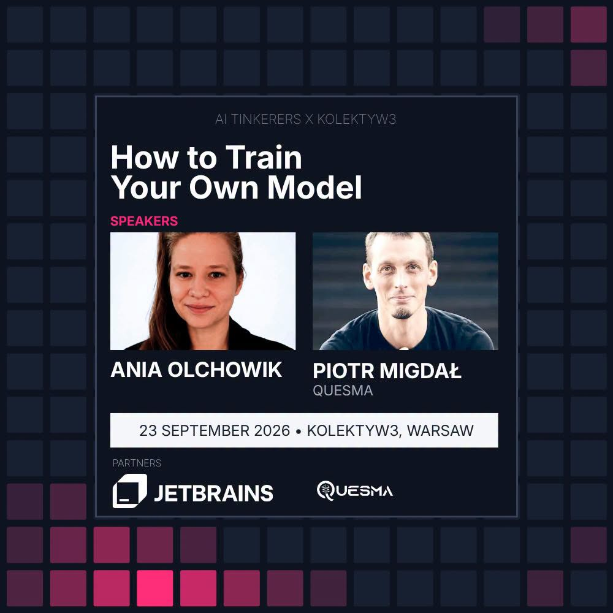

# AI from scratch

[Model training workshop](https://luma.com/Warsaw-Model-Trainers-w3) with **[Piotr Migdał](https://p.migdal.pl/) and Anna Olchowik**, organized by [Kolektyw3](https://luma.com/kolektyw3) as preparation for the [Warsaw Model Trainers hackathon](https://luma.com/Warsaw-Model-Trainers-hackathon?tk=tXTOg3).

Train a small language model from scratch, then adapt existing models. Polish materials, English explanations, ordinary runnable scripts.

[](https://luma.com/Warsaw-Model-Trainers-w3)

## Setup

Install [uv](https://docs.astral.sh/uv/getting-started/installation/) and [pnpm](https://pnpm.io/installation/). Run commands from this repository's folder. Scripts use **Python 3.14**; uv downloads it if needed.

Install [Modal](https://modal.com/) to run GPU jobs:

```bash
uv tool install modal==1.5.5
```

Connect your account and follow the browser login:

```bash
modal setup
```

## Visualization

```bash
pnpm visualization
```

Opens the tokenizer, training curves and before/after examples. Each section has a saved example; live runs appear in the run selector. Leave it open while training.

## 1. Data and tokenization

[Start here: data and tokens](01-data-and-tokens.md). To prepare [Wolne Lektury](https://wolnelektury.pl/), run:

```bash
modal run scripts/prepare_data_modal.py
```

Modal downloads **123 MB** and prepares **101 million training tokens** in your cloud volume. The corpus does not pass through your laptop. While it runs, follow the guide's tokenizer example and [byte-pair encoding (BPE)](https://en.wikipedia.org/wiki/Byte_pair_encoding) visualization. Preparation uses paid CPU time, not a GPU.

## 2. Pretraining

After preparation says **Ready**, [train a small model from random weights](02-pretraining.md):

```bash
modal run scripts/scratch_recipe_modal.py --recipe wolne-lektury
```

30M parameters on H100. Training takes 10 minutes; the measured run took 11 min 32 s including evaluation and cost $0.78. [Compare GPUs](02-pretraining.md#choosing-a-gpu).

Open **Pretraining** in the visualization to watch loss and generated text at each checkpoint.

## 3. Supervised fine-tuning (SFT)

[Train Qwen3.5-0.8B for the Polish Driving Licence Exam](03-fine-tuning.md), using question → correct-answer examples:

```bash
modal run scripts/prawko_modal.py --method sft --epochs 10 --max-seconds 180
```

**Up to 3 minutes, about $0.065 measured worker compute.** The included dataset needs no preparation; you can start this while pretraining runs. Open **SFT** to see the training input, target answer and changing A/B/C probabilities.

## 4. Reinforcement learning with verifiable rewards (RLVR)

[Teach Qwen3.5-4B to write exactly six words](04-reinforcement-learning.md). The model tries answers; code checks them and supplies rewards:

```bash
modal run scripts/rlvr_showcase_modal.py --task six_words
```

**Up to 10 minutes, about $0.19 measured worker compute.** This starts from the original Qwen model, independently of SFT. Open **RLVR** to see sampled answers, their rewards and development success.

## Additional tasks

Experiment with the tokenizer using your own text.

## Running the exercises

Exercises 3 and 4 are independent of pretraining. You can run jobs in separate terminals; each job is billed separately. Keep the training terminal connected for live updates. Results are saved in `runs/`.

The main path used about **$1.04 in worker compute** in our experiments. These are historical measurements, not caps; loading/evaluation add time and builds/storage cost extra.

## Explore further

Each exercise ends with a small experiment. Options include Wikipedia pretraining, longer exam training, comparing SFT with RLVR on the exam, and [answering in verse](additional/poetry.md). [Compare saved results](results/README.md).

## Files

The four numbered guides are the main path. `scripts/` contains runnable code and its model settings (`models.json`). `datasets/` contains inputs; large downloads in `datasets/local/` are gitignored. `visualization/` contains the browser app; `results/` contains shared reports; `runs/` contains your generated outputs and is gitignored. `additional/` holds optional exercises and research; `LAB_NOTEBOOK.md` records findings.

Codex or Claude are optional helpers. Other GPU platforms include [Google Colab](https://colab.research.google.com/) and [Lightning AI](https://lightning.ai/); these commands use Modal.

## Learn more

- [RecurrentJS — Andrej Karpathy](https://cs.stanford.edu/people/karpathy/recurrentjs/): train an RNN/LSTM in your browser and watch it learn to generate text.
- [MiMo-V2.6 RL dashboard](https://mimo.xiaomi.com/rl/): public post-training dashboard from Xiaomi's MiMo team, led by Luo Fuli. See also [HN discussion](https://news.ycombinator.com/item?id=49732270).
- [MicroGPT — Andrej Karpathy](https://karpathy.github.io/2026/02/12/microgpt/): a complete GPT in 200 lines of Python.
- [Let's build GPT from scratch](https://www.youtube.com/watch?v=kCc8FmEb1nY): Karpathy's step-by-step coding walkthrough.
- [Hugging Face LLM Course](https://huggingface.co/learn/llm-course/en/chapter1/4): transformers, pretraining and fine-tuning.
- [Nanochat](https://github.com/karpathy/nanochat): explore a complete language-model training pipeline.
- [Thinking in tensors, writing in PyTorch](https://github.com/stared/thinking-in-tensors-writing-in-pytorch): Piotr's hands-on introduction to neural networks.
