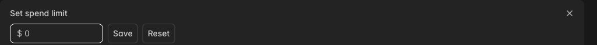

# Modal setup

Complete this setup before running the workshop commands.

## Create your Modal account

1. Open [Modal sign-up](https://modal.com/signup). Choose **Continue with GitHub** or **Continue with Google**, then complete the prompts. Already registered? Choose **Log in**.
2. Open the [dashboard](https://modal.com/apps). Select your personal workspace using the name menu at the top left. A workspace holds your jobs, files and billing. Use the same workspace throughout this workshop.
3. Open **Settings → Workspaces** if you need to find your workspace. Then select **Usage & billing** under **Billing & limits**.
4. Check the **Credits** tab for your available credits. Do not assume you have the full advertised allowance. Modal currently requires a payment method; use **Manage payment details** if needed. Review any payment prompt before accepting it. See [Modal billing](https://modal.com/docs/guide/billing).

## Set a spending limit to 0 before running jobs

On **Usage & billing → Usage limit**:

1. Find **Spend limit**, then click **Edit spend limit**.
2. To use available credits without allowing further paid compute, enter **0** and click **Save**.
3. Check that the saved **Spend limit** shows **$0**.



*Example before saving. Cropped from the dashboard on 23 September 2026; account details are excluded.*

Modal provides free credits that cover some usage. Once those credits run out, further usage costs your own money. **Spend limit** sets the maximum additional amount you allow yourself to be charged each month. For example, a **$5 spend limit** allows up to $5 of paid usage on top of your credits; **$0** allows only credit-funded workloads. Stored files are an exception, explained below.

**Usage limit** is the total dollar value of usage your workspace can consume during a billing cycle, including usage covered by free credits. Even if you are willing to pay more, Modal limits the maximum usage allowed for your workspace. This limits how much GPU time you can buy; it is not a count of GPUs. Modal can raise the maximum after successful payments. See [Modal budgets](https://modal.com/docs/guide/budgets).

Do not set the usage limit to zero: that would also block credit-funded work.

**You pay for file storage in addition to GPU and CPU time.** Files saved in Modal volumes stay there after training ends, so storage charges can continue after workloads stop. After the workshop, download any model checkpoints or results you want to keep, then delete the workshop files or volumes you no longer need from **Storage** in the Modal dashboard.

## Install the tools and connect your computer

Install these two tools using their linked instructions:

- **[uv](https://docs.astral.sh/uv/getting-started/installation/)** manages Python versions and packages. We use it to install Modal and run Python scripts with the dependencies they need. The workshop uses **Python 3.14**; uv downloads it if needed.
- **[pnpm](https://pnpm.io/installation/)** manages JavaScript packages and runs commands defined by a project. In this workshop, `pnpm dev` starts the local visualization so you can explore tokens and view training results in your browser.

Run all commands from this repository's folder.

Install the Modal command-line tool:

```bash
uv tool install modal==1.5.5
```

Connect it to your account:

```bash
modal setup
```

In the browser, sign in with the account you created above. Select the same workspace and approve the authorization request. This lets your terminal submit jobs to that workspace. Return to the terminal and wait for setup to finish. If the browser does not open, use the link printed in the terminal. Keep credentials private.

## Check that setup worked

```bash
modal token info
```

This checks your connection and displays information about the active token. It does **not** launch a training job. Confirm that it succeeds and identifies your intended workspace. This is the verification command in [Modal's getting-started guide](https://modal.com/docs/guide/getting-started).

- **`modal: command not found`:** run `uv tool update-shell`, open a new terminal, and try again.
- **Authentication fails or the wrong workspace appears:** rerun `modal setup` and authorize the intended workspace.
- **Billing or limit error:** return to **Usage & billing**.

Setup is complete when the connection check succeeds and you have checked your workspace's credits and saved spending limit. Return to the [README visualization section](README.md#visualization), then continue with data preparation. These setup steps do not start the exercises.

