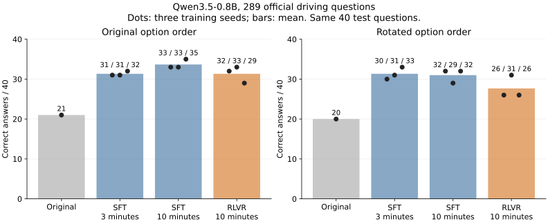
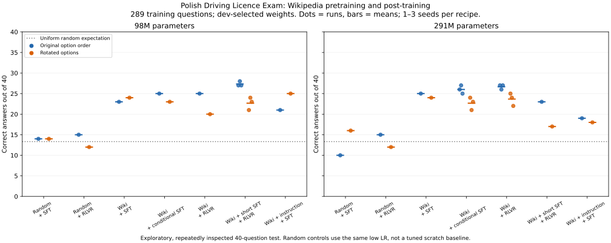
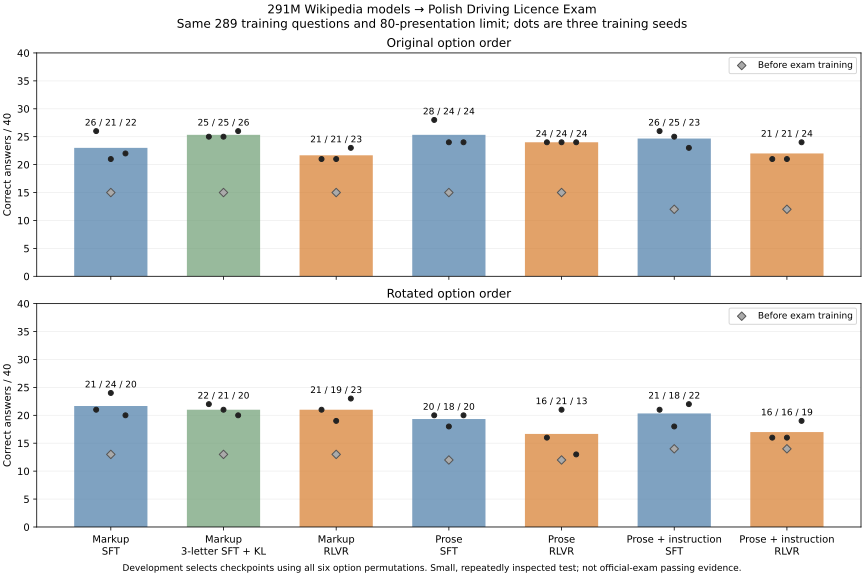
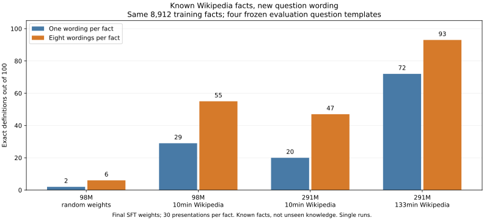
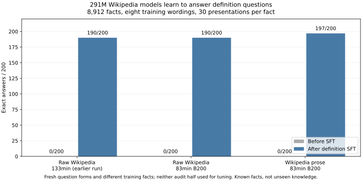
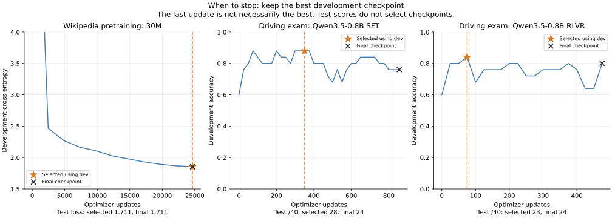
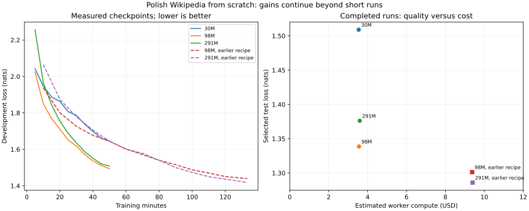
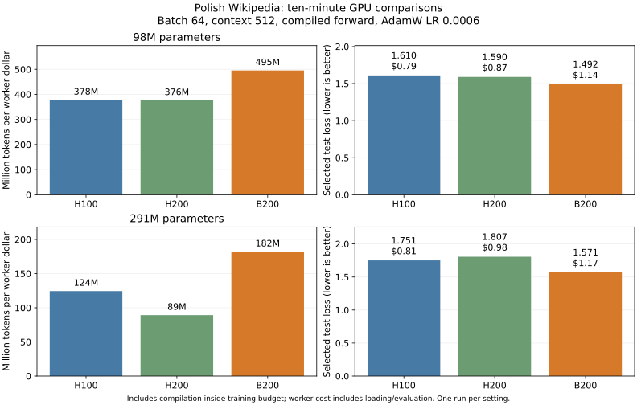
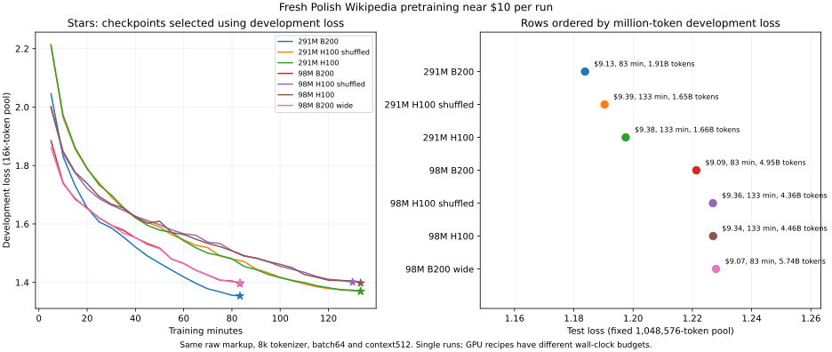

# Training comparisons

Exploratory measurements, not guaranteed outcomes. Training checkpoints are selected using development data; separately labeled final-weight diagnostics expose what this selection can miss. Test sets are small and have been inspected in previous experiments; these are not fresh, blind benchmarks.

Plain-text corpus v1 and the earlier 5,000-definition data used a faulty reference-removal expression. It could delete intervening prose after a self-closing ref. Those data comparisons are superseded; original-markup Wikipedia and Wolne Lektury are unaffected. Version2 fixes this with a regression test.

Costs are worker GPU + CPU/memory estimates, excluding image builds, controller and storage. Post-training and continued-pretraining costs exclude the earlier pretraining. For chains, the cost shown on each stage row is the whole run, not an additional charge. Losses on different corpora cannot be compared directly. Existing-model SFT→RLVR chains use the original base model as the KL reference; scratch-model chains use the SFT checkpoint. These are different regularization choices. Wikipedia definition loss uses up to50 held-out examples in earlier runs and200 in the100k-example study, retaining original pretraining splits. This differs from recall of familiar training entities. Poetry loss uses25 held-out prompts, but their source verses may appear in pretraining. Larger corpus evaluations use a separate fixed seed and1,048,576 tokens per split; keep them separate from the original16,384-token live curves.

Failed/canceled calls recorded: 14; known worker estimates $0.042. Canceled calls with unknown billing retain conservative timeout reservations in the local budget ledger; they are not counted as free.

Completed workers: 81 pretraining, 162 post-training, 108 evaluation only. These are runs, not distinct model architectures.

Worker compute in this report: $273.178.

## What changed

- For ten-minute Wolne Lektury pretraining, H100 processed more tokens per dollar than L4. Compiling the training forward almost doubled throughput again; it did not double text quality.
- The cheaper expanded-data SFT recipe reached 31–32/40 across three seeds in three minutes, about $0.07 per worker. Rotated options gave 30–33/40. This is the practical workshop extension.
- Qwen3.5-0.8B + SFT on 289 official driving questions reached 33–35/40 across three seeds, versus 21/40 before training. Direct RLVR reached 29–33/40. Each run cost about $0.19; rotated options reveal remaining sensitivity.
- On 289 driving questions, Wikipedia-pretrained 291M direct RLVR reached 26–27/40 across three seeds. A matched three-action supervised loss plus the same KL penalty reached 25–27/40; rotated options gave 22–25 and 21–24 respectively. This small, repeatedly inspected test does not establish a large RLVR advantage or official-exam passing ability.
- Grounded SFT on 9,602 Wikipedia definitions learned answer formatting and some familiar paragraphs. Longer training worsened held-out definition loss while improving recall of a Warsaw training example. The earlier 5,000-definition experiment used faulty reference removal and is superseded. Wolne Lektury + Pan Tadeusz Q&A learned verse-like replies with weak relevance and meter.
- With an explanation prompt, Qwen3.5-2B RLVR improved strict final-answer compliance from 0 to 25/40 by removing explanations. Accepting the explicit answer anywhere gives 25/40 both before and after. The reward did not require an explanation; this is format learning, not evidence of better reasoning. The any-position score is a post-hoc diagnostic, not the training reward.
- Thirty-minute Wolne Lektury pretraining improved test loss to 2.720 for $2.12. Ten minutes with compilation reached 2.748 for $0.73: a more practical workshop recipe.
- Original-markup Wikipedia 98M test loss improved from 1.619 at ten minutes to 1.426 at thirty and 1.339 at fifty ($3.56 worker compute). The older 133-minute recipe reached 1.301. Schedules and batches differ; loss gains continue, but generated facts remain unreliable.
- Another fifty minutes improved all four Wikipedia checkpoints. On the separate million-token test pool, 98M improved 1.303→1.241 from the fifty-minute base; 291M improved 1.328→1.249. The older 133-minute bases improved 1.265→1.222 and 1.246→1.201. Extra worker cost: $3.55–3.62 each. Driving-exam transfer did not improve consistently.
- Short-definition SFT produces a visible narrow result: the historical 291M Wikipedia model recalls 72/100 known definitions after single-wording SFT versus 93/100 after eight-wording SFT, with 30 presentations per fact in both. It still fails arithmetic and general instructions. This is recall of supplied facts, not an unseen-knowledge benchmark.
- The first seven fresh raw-Wikipedia candidates near $10 were compared using the same million-token development pool. They selected the 291M B200 run: 83 minutes, $9.13, test loss1.184. Its generated facts remain unreliable. Downstream exam scores also do not beat the earlier checkpoint: SFT21–26/40, three-action SFT+KL25–26/40, RLVR21–23/40 across three seeds.
- Two further 83-minute B200 runs did not beat that selection: raising peak LR to0.0006 for291M gives test loss1.190 ($9.19), and to0.0012 for98M gives1.249 ($9.10). The original291M recipe remains best on development loss among all nine raw-Wikipedia candidates. These new runs include extra diagnostics, so they are equal-time recipe comparisons rather than a perfectly isolated learning-rate ablation.
- B200 processed 567M tokens for $1.14 with 98M parameters in ten minutes, versus 298M for $0.79 on H100 and 328M for $0.87 on H200, at batch64/context512. Hardware and compilation startup matter; token throughput alone is not model quality.
- On a fresh, frozen 200-question wording audit, all three 291M bases went from 0 exact answers to 190/200 (both markup models) or 197/200 (prose) after definition SFT. Answers were supplied during SFT; this measures known-fact recall under new wording, not unseen knowledge. The older-versus-newer markup gap on the original probes did not repeat.
- General Polish instruction SFT did not consistently help the prose-model driving comparison across three seeds: direct SFT24–28/40 versus instruction→SFT23–26/40; direct RLVR24/40 versus instruction→RLVR21–24/40. Rotating options lowers these scores. General instruction probes still fail arithmetic, copying and reading comprehension.

[Model, data, costs and literal answers](wiki-qa-example-results.md).

Original markup, shared 8k tokenizer. Schedules, batches and compilation differ; this is not a controlled scaling-law estimate. Lower text loss does not establish factual accuracy.

## GPU and architecture comparisons

|Model|Corpus|Context|GPU|Training min|Test loss|Tokens M|Corpus-equivalents|Tokens M / $|Worker $|
|---|---|---|---|---|---|---|---|---|---|
|ScratchGPT-30m|wl-scratch-v1|1024|H100|10.0|9.073 → 2.821|419.6|4.14|567.3|$0.740|
|ScratchGPT-30m-wide|wl-scratch-v1|512|H100|10.0|9.096 → 2.789|480.1|4.74|656.1|$0.732|
|ScratchGPT-30m|wl-scratch-v1|512|A10|10.0|9.073 → 3.064|72.2|0.71|315.6|$0.229|
|ScratchGPT-30m|wl-scratch-v1|512|H100|10.0|9.073 → 2.784|394.4|3.89|534.0|$0.738|
|ScratchGPT-30m|wl-scratch-v1|512|L4|10.0|9.073 → 3.152|50.0|0.49|277.8|$0.180|
|ScratchGPT-30m|wl-scratch-v1|512|L40S|10.0|9.073 → 2.885|180.1|1.78|478.0|$0.377|
|ScratchGPT-30m|wiki-scratch-v1|512|H100|10.0|9.081 → 1.711|403.9|0.13|539.6|$0.749|
|ScratchGPT-30m-wide|wiki-scratch-v1|512|H100|10.0|9.138 → 1.716|489.7|0.16|656.4|$0.746|
|ScratchGPT-30m|wl-scratch-v1|512|H100|10.0|9.073 → 2.748|723.7|7.14|990.0|$0.731|
|ScratchGPT-30m|wl-scratch-v1|512|H100|30.0|9.073 → 2.720|1260.1|12.44|594.7|$2.119|
|ScratchGPT-100m|wiki-scratch-v1|512|H100|10.0|9.174 → 1.619|272.5|0.09|356.2|$0.765|
|ScratchGPT-100m|wiki-scratch-v1|512|L40S|10.0|9.174 → 1.914|79.1|0.03|202.3|$0.391|
|ScratchGPT-300m|wiki-scratch-v1|512|H100|10.0|9.210 → 1.790|95.0|0.03|119.2|$0.797|
|ScratchGPT-300m|wiki-scratch-v1|512|L40S|10.0|9.210 → 2.480|23.7|0.01|58.4|$0.406|
|ScratchGPT-100m|wiki-scratch-v1|512|H100|30.0|9.174 → 1.426|920.4|0.29|430.9|$2.136|
|ScratchGPT-30m|wiki-scratch-v1|512|H100|10.0|9.081 → 1.653|717.2|0.23|972.2|$0.738|
|ScratchGPT-100m|wiki-leads-v1|512|H100|10.0|9.153 → 1.740|285.0|1.61|380.8|$0.748|
|ScratchGPT-100m [superseded data]|wiki-plain-leads-v1|512|H100|10.0|9.171 → 2.154|284.9|3.63|381.2|$0.747|
|ScratchGPT-300m|wiki-leads-v1|512|H100|10.0|9.216 → 1.843|102.8|0.58|133.9|$0.768|
|ScratchGPT-300m [superseded data]|wiki-plain-leads-v1|512|H100|10.0|9.228 → 2.199|103.0|1.31|134.6|$0.765|
|ScratchGPT-30m|wiki-leads-v1|512|H100|10.0|9.092 → 1.771|705.6|3.98|953.3|$0.740|
|ScratchGPT-30m [superseded data]|wiki-plain-leads-v1|512|H100|10.0|9.116 → 2.196|709.3|9.03|959.5|$0.739|
|ScratchGPT-100m-deep|wiki-scratch-v1|512|H100|10.0|9.134 → 1.696|192.4|0.06|232.7|$0.827|
|ScratchGPT-100m|wiki-scratch-v1|512|H100|10.0|9.174 → 1.636|276.4|0.09|353.5|$0.782|
|ScratchGPT-100m-wide|wiki-scratch-v1|512|H100|10.0|9.223 → 1.599|336.1|0.11|436.9|$0.769|
|ScratchGPT-300m|wiki-scratch-v1|512|H100|10.0|9.210 → 2.007|94.4|0.03|107.2|$0.881|
|ScratchGPT-100m|wiki-scratch-v1|512|H100|50.0|9.174 → 1.339|1632.9|0.52|459.0|$3.557|
|ScratchGPT-100m|wiki-scratch-v1|512|H100|50.0|9.174 → 1.402|1528.3|0.49|431.4|$3.543|
|ScratchGPT-300m|wiki-scratch-v1|512|H100|50.0|9.210 → 1.376|606.9|0.19|168.7|$3.598|
|ScratchGPT-30m|wiki-scratch-v1|512|H100|50.0|9.081 → 1.509|3618.1|1.15|1021.0|$3.544|
|ScratchGPT-100m (continued) [superseded data]|wiki-plain-leads-v1|512|H100|10.0|2.444 → 1.940|282.1|3.59|374.2|$0.754|
|ScratchGPT-100m-wide|wiki-scratch-v1|512|H100|50.0|9.223 → 1.380|1773.7|0.56|500.9|$3.541|
|ScratchGPT-300m (continued) [superseded data]|wiki-plain-leads-v1|512|H100|10.0|2.401 → 1.908|95.4|1.21|119.5|$0.798|
|ScratchGPT-100m|wiki-scratch-v1 + wl-wiki-bpe-v1|512|H100|10.0|9.174 → 1.773|272.4|0.04 + 1.34|352.0|$0.774|
|ScratchGPT-300m|wiki-scratch-v1 + wl-wiki-bpe-v1|512|H100|10.0|9.210 → 1.964|101.3|0.02 + 0.50|128.2|$0.790|
|ScratchGPT-100m (continued)|wiki-plain-leads-v2|512|H100|10.0|2.479 → 2.020|280.6|3.44|368.0|$0.762|
|ScratchGPT-100m|wiki-plain-leads-v2|512|H100|10.0|9.162 → 2.227|266.4|3.27|346.8|$0.768|
|ScratchGPT-100m|wiki-plain-leads-v2|512|H100|50.0|9.162 → 2.238|1658.5|20.33|468.9|$3.537|
|ScratchGPT-300m (continued)|wiki-plain-leads-v2|512|H100|10.0|2.426 → 1.989|97.6|1.20|119.8|$0.815|
|ScratchGPT-300m|wiki-plain-leads-v2|512|H100|10.0|9.221 → 2.276|103.3|1.27|132.3|$0.781|
|ScratchGPT-300m|wiki-plain-leads-v2|512|H100|50.0|9.221 → 2.226|609.0|7.47|170.3|$3.575|
|ScratchGPT-100m (continued)|wiki-scratch-v1|512|H100|50.0|1.339 → 1.277|1633.6|0.52|460.0|$3.551|
|ScratchGPT-100m (continued)|wiki-scratch-v1|512|H100|50.0|1.301 → 1.256|1634.9|0.52|459.7|$3.557|
|ScratchGPT-300m (continued)|wiki-scratch-v1|512|H100|50.0|1.376 → 1.284|616.1|0.20|170.3|$3.618|
|ScratchGPT-300m (continued)|wiki-scratch-v1|512|H100|50.0|1.286 → 1.236|614.3|0.20|171.3|$3.586|
|ScratchGPT-100m|wiki-scratch-v1|1024|H100|10.0|9.174 → 1.666|264.8|0.08|347.5|$0.762|
|ScratchGPT-100m|wiki-scratch-v1|512|H100|10.0|9.174 → 1.610|297.8|0.09|377.8|$0.788|
|ScratchGPT-300m|wiki-scratch-v1|512|H100|10.0|9.210 → 1.751|101.2|0.03|124.4|$0.813|
|ScratchGPT-100m|wiki-scratch-v1|256|H100|10.0|9.174 → 1.574|290.1|0.09|365.8|$0.793|
|ScratchGPT-100m|wiki-scratch-v1|512|H100|10.0|9.174 → 1.638|325.6|0.10|425.4|$0.765|
|ScratchGPT-300m|wiki-scratch-v1|512|H100|10.0|9.210 → 1.771|106.8|0.03|131.5|$0.812|
|ScratchGPT-100m (continued)|wiki-scratch-v1 + wiki-plain-leads-v2|512|H100|50.0|1.301 → 1.301|1580.5|0.25 + 9.69|442.6|$3.571|
|ScratchGPT-100m (continued)|wiki-scratch-v1 + wiki-popular-v1|512|H100|50.0|1.301 → 1.287|1652.7|0.46 + 45.49|466.2|$3.545|
|ScratchGPT-300m (continued)|wiki-scratch-v1 + wiki-plain-leads-v2|512|H100|50.0|1.286 → 1.286|655.3|0.10 + 4.02|179.1|$3.658|
|ScratchGPT-300m (continued)|wiki-scratch-v1 + wiki-popular-v1|512|H100|50.0|1.286 → 1.260|656.6|0.18 + 18.07|183.3|$3.583|
|ScratchGPT-100m|wiki-scratch-v1|512|H100|133.3|9.174 → 1.261|4462.8|1.42|477.8|$9.340|
|ScratchGPT-100m|wiki-scratch-v1 + wiki-popular-v1|512|H100|133.3|9.174 → 1.320|4465.7|1.24 + 122.92|478.0|$9.342|
|ScratchGPT-100m|wiki-scratch-v1 + wl-scratch-v1|512|H100|133.3|9.174 → 1.308|4368.1|1.04 + 10.78|466.7|$9.359|
|ScratchGPT-300m|wiki-scratch-v1|512|H100|133.3|9.210 → 1.227|1664.3|0.53|177.5|$9.379|
|ScratchGPT-100m|wiki-scratch-v1|512|H100|133.3|9.174 → 1.262|4356.1|1.39|465.6|$9.356|
|ScratchGPT-300m|wiki-scratch-v1|512|H100|133.3|9.210 → 1.230|1647.1|0.52|175.5|$9.386|
|ScratchGPT-100m|wiki-scratch-v1|512|B200|10.0|9.174 → 1.492|566.8|0.18|495.4|$1.144|
|ScratchGPT-100m|wiki-scratch-v1|512|H200|10.0|9.174 → 1.590|327.9|0.10|376.2|$0.872|
|ScratchGPT-300m|wiki-scratch-v1|512|B200|10.0|9.210 → 1.571|213.4|0.07|182.0|$1.172|
|ScratchGPT-300m|wiki-scratch-v1|512|H200|10.0|9.210 → 1.807|87.5|0.03|89.2|$0.981|
|ScratchGPT-100m|wiki-scratch-v1|512|B200|83.3|9.174 → 1.251|4948.9|1.58|544.6|$9.088|
|ScratchGPT-100m-wide|wiki-scratch-v1|512|B200|83.3|9.223 → 1.260|5742.4|1.83|632.8|$9.074|
|ScratchGPT-300m|wiki-scratch-v1|512|B200|83.3|9.210 → 1.214|1913.5|0.61|209.5|$9.132|
|ScratchGPT-100m [Muon]|wiki-scratch-v1|512|H100|10.0|9.174 → 1.675|248.6|0.08|325.2|$0.765|
|ScratchGPT-100m [Muon]|wiki-scratch-v1|512|H100|10.0|9.174 → 1.610|249.6|0.08|323.9|$0.771|
|ScratchGPT-100m [Muon]|wiki-scratch-v1|512|H100|10.0|9.174 → 1.577|253.9|0.08|329.3|$0.771|
|ScratchGPT-300m [Muon]|wiki-scratch-v1|512|H100|10.0|9.210 → 1.771|85.5|0.03|105.9|$0.807|
|ScratchGPT-100m|wiki-plain-full-v1|512|B200|83.3|9.171 → 1.978|5067.9|4.69|559.6|$9.056|
|ScratchGPT-100m (continued)|wiki-plain-full-v1|512|B200|50.0|2.771 → 2.008|3032.4|2.80|555.3|$5.461|
|ScratchGPT-300m|wiki-plain-full-v1|512|B200|83.3|9.208 → 1.912|1984.7|1.84|218.4|$9.086|
|ScratchGPT-100m [Muon]|wiki-scratch-v1|512|B200|10.0|9.174 → 1.475|475.9|0.15|418.2|$1.138|
|ScratchGPT-100m|wiki-scratch-v1|512|H100|10.0|9.174 → 1.582|307.0|0.10|406.9|$0.754|
|ScratchGPT-100m [Muon]|wiki-scratch-v1|512|H100|10.0|9.174 → 1.591|251.1|0.08|327.0|$0.768|
|ScratchGPT-300m [Muon]|wiki-scratch-v1|512|H100|10.0|9.210 → 1.801|71.9|0.02|85.0|$0.846|
|ScratchGPT-100m|wiki-scratch-v1|512|B200|83.3|9.174 → 1.275|4881.9|1.55|536.2|$9.104|
|ScratchGPT-300m|wiki-scratch-v1|512|B200|83.3|9.210 → 1.215|1854.4|0.59|201.7|$9.194|

## Driving exam: existing models

|Starting model|Method|Train questions|GPU / batch|LR|Seed|Test /40|Dev /25|Rotated /40|Training min|Run worker $|
|---|---|---|---|---|---|---|---|---|---|---|
|Qwen/Qwen3.5-0.8B|rlvr|100|L4/batch 4|5e-05|42|21 → 23|21|25|10.0|$0.185|
|Qwen/Qwen3.5-0.8B|sft|100|L4/batch 4|5e-05|42|21 → 28|22|29|10.0|$0.182|
|Qwen/Qwen3.5-2B|rlvr|100|L4/batch 4|5e-05|42|26 → 28|22|27|10.0|$0.198|
|Qwen/Qwen3.5-2B|sft|100|L4/batch 4|5e-05|42|26 → 27|22|27|10.0|$0.196|
|Qwen/Qwen3.5-0.8B|sft + answer text|100|L4/batch 4|2e-05|42|14 → 28|20|25|1.0|$0.030|
|Qwen/Qwen3.5-0.8B|rlvr|100|L4/batch 4|2e-05|123|21 → 28|22|26|10.0|$0.182|
|Qwen/Qwen3.5-0.8B|sft|100|L4/batch 4|2e-05|123|21 → 29|23|30|10.0|$0.184|
|Qwen/Qwen3.5-0.8B|sft + answer text|100|L4/batch 4|2e-05|42|14 → 31|21|26|10.0|$0.181|
|Qwen/Qwen3.5-0.8B|sft|100|L4/batch 4|2e-05|42|21 → 27|22|30|10.0|$0.359|
|Qwen/Qwen3.5-0.8B|sft → rlvr|100|L4/batch 4|2e-05|42|27 → 30|23|25|10.0|$0.359|
|Qwen/Qwen3.5-2B|sft + answer text|100|L4/batch 4|2e-05|42|12 → 27|23|27|10.0|$0.186|
|Qwen/Qwen3.5-2B|sft|100|L4/batch 4|2e-05|42|26 → 28|23|29|10.0|$0.376|
|Qwen/Qwen3.5-2B|sft → rlvr|100|L4/batch 4|2e-05|42|28 → 26|24|26|10.0|$0.376|
|Qwen/Qwen3.5-4B|rlvr|100|L40S/batch 4|2e-05|42|31 → 32|23|32|10.0|$0.391|
|Qwen/Qwen3.5-4B|sft|100|L4/batch 2|2e-05|42|32 → 33|23|34|10.1|$0.214|
|Qwen/Qwen3.5-4B|sft|100|L40S/batch 4|2e-05|42|31 → 35|23|32|10.0|$0.391|
|Qwen/Qwen3.5-0.8B|rlvr|289|L4/batch 4|2e-05|42|21 → 32|21|26|10.0|$0.187|
|Qwen/Qwen3.5-0.8B|sft|289|L4/batch 4|2e-05|42|21 → 33|20|32|10.0|$0.190|
|Qwen/Qwen3.5-2B|rlvr|289|L4/batch 4|2e-05|42|26 → 27|22|26|10.0|$0.191|
|Qwen/Qwen3.5-2B|sft|289|L4/batch 4|2e-05|42|26 → 26|24|25|10.0|$0.190|
|Qwen/Qwen3.5-0.8B|rlvr|289|L4/batch 4|2e-05|123|21 → 33|21|31|10.0|$0.194|
|Qwen/Qwen3.5-0.8B|rlvr|289|L4/batch 4|2e-05|2026|21 → 29|22|26|10.0|$0.189|
|Qwen/Qwen3.5-0.8B|sft|289|L4/batch 4|2e-05|123|21 → 33|21|29|10.0|$0.190|
|Qwen/Qwen3.5-0.8B|sft|289|L4/batch 4|2e-05|2026|21 → 35|21|32|10.0|$0.190|
|Qwen/Qwen3.5-0.8B|sft|289|L4/batch 4|2e-05|42|21 → 32|20|33|3.0|$0.072|
|Qwen/Qwen3.5-4B|rlvr|289|L40S/batch 4|2e-05|42|31 → 32|24|34|10.0|$0.403|
|Qwen/Qwen3.5-4B|sft|289|L40S/batch 4|2e-05|42|31 → 36|24|34|10.0|$0.402|
|Qwen/Qwen3.5-0.8B|sft|289|L4/batch 4|2e-05|123|21 → 31|20|30|3.0|$0.071|
|Qwen/Qwen3.5-0.8B|sft|289|L4/batch 4|2e-05|2026|21 → 31|19|31|3.0|$0.071|

## Scratch models after pretraining

|Starting checkpoint|Initialization|Task|Stage|LR|Test correct /40 or answer loss|Training min|Run worker $|
|---|---|---|---|---|---|---|---|
|98.3M Polish Wikipedia|pretrained|100 driving questions|sft|0.0001|12 → 16|1.0|$0.041|
|98.3M Polish Wikipedia|pretrained|100 driving questions|sft → rlvr|0.0001|12 → 15|1.0|$0.041|
|98.3M Polish Wikipedia|pretrained|5,000 Wikipedia definitions|sft|0.0001|2.304 → 1.785|1.0|$0.033|
|29.9M Wolne Lektury|pretrained|450 Pan Tadeusz Q&A|sft|0.0001|3.081 → 2.809|1.0|$0.028|
|98.3M random weights|random|100 driving questions|rlvr|2e-05|15 → 15|10.0|$0.173|
|98.3M random weights|random|100 driving questions|sft|2e-05|15 → 15|10.0|$0.173|
|98.3M Polish Wikipedia|pretrained|100 driving questions|sft|2e-05|12 → 20|10.0|$0.347|
|98.3M Polish Wikipedia|pretrained|100 driving questions|sft → rlvr|2e-05|12 → 18|10.0|$0.347|
|98.3M Polish Wikipedia|pretrained|100 driving questions|rlvr|2e-05|12 → 12|10.0|$0.175|
|98.3M Polish Wikipedia|pretrained|100 driving questions|sft|2e-05|12 → 20|10.0|$0.175|
|98.3M Polish Wikipedia|pretrained|450 Pan Tadeusz Q&A|sft|2e-05|4.070 → 3.505|10.0|$0.187|
|98.3M Polish Wikipedia|pretrained|5,000 Wikipedia definitions|sft|2e-05|2.304 → 1.607|10.0|$0.183|
|291.0M Polish Wikipedia|pretrained|100 driving questions|sft|2e-05|13 → 20|10.0|$0.352|
|291.0M Polish Wikipedia|pretrained|100 driving questions|sft → rlvr|2e-05|13 → 20|10.0|$0.352|
|291.0M Polish Wikipedia|pretrained|100 driving questions|rlvr|2e-05|13 → 13|10.0|$0.181|
|291.0M Polish Wikipedia|pretrained|100 driving questions|sft|2e-05|13 → 20|10.0|$0.180|
|291.0M Polish Wikipedia|pretrained|5,000 Wikipedia definitions|sft|2e-05|2.193 → 1.577|10.0|$0.192|
|98.3M Wolne Lektury|pretrained|100 driving questions|rlvr|2e-05|12 → 12|10.0|$0.175|
|98.3M Wolne Lektury|pretrained|100 driving questions|sft|2e-05|12 → 19|10.0|$0.176|
|98.3M Wolne Lektury|pretrained|450 Pan Tadeusz Q&A|sft|2e-05|2.865 → 2.444|10.0|$0.185|
|29.9M Wolne Lektury|pretrained|100 driving questions|rlvr|2e-05|14 → 14|10.0|$0.175|
|29.9M Wolne Lektury|pretrained|100 driving questions|sft|2e-05|14 → 22|10.0|$0.175|
|29.9M Wolne Lektury|pretrained|450 Pan Tadeusz Q&A|sft|2e-05|3.081 → 2.736|10.0|$0.180|
|98.3M Polish Wikipedia|pretrained|100 driving questions|rlvr (LoRA 8)|5e-05|12 → 12|1.0|$0.025|
|98.3M Polish Wikipedia|pretrained|100 driving questions|sft (LoRA 8)|5e-05|12 → 22|10.0|$0.177|
|291.0M Polish Wikipedia|pretrained|100 driving questions|sft (LoRA 8)|5e-05|13 → 22|10.0|$0.182|
|98.3M Polish Wikipedia|pretrained|289 driving questions|sft|2e-05|12 → 22|10.0|$0.177|
|291.0M Polish Wikipedia|pretrained|289 driving questions|sft (LoRA 8)|5e-05|13 → 23|10.0|$0.185|
|291.0M Polish Wikipedia|pretrained|289 driving questions|sft|2e-05|13 → 21|10.0|$0.181|
|29.9M Wolne Lektury|pretrained|289 driving questions|sft|2e-05|14 → 23|10.0|$0.175|
|98.3M Polish Wikipedia|pretrained|289 driving questions|sft|1e-05|12 → 22|0.2|$0.040|
|98.3M Polish Wikipedia|pretrained|Polish OWCA instructions|sft|3e-05|2.625 → 1.988|1.0|$0.141|
|291.0M Polish Wikipedia|pretrained|289 driving questions|sft|1e-05|13 → 23|0.2|$0.067|
|291.0M Polish Wikipedia|pretrained|Polish OWCA instructions|sft|3e-05|2.603 → 2.011|1.0|$0.164|
|98.3M Polish Wikipedia|pretrained|Polish OWCA instructions|sft|0.0001|2.625 → 1.962|3.2|$0.291|
|98.3M Polish Wikipedia|pretrained|Polish OWCA instructions|sft|3e-05|2.625 → 1.876|3.5|$0.304|
|291.0M Polish Wikipedia|pretrained|Polish OWCA instructions|sft|0.0001|2.603 → 1.953|6.4|$0.548|
|291.0M Polish Wikipedia|pretrained|Polish OWCA instructions|sft|3e-05|2.603 → 1.902|6.3|$0.538|
|98.3M Polish Wikipedia|pretrained|289 driving questions|rlvr|1e-06|12 → 25|0.9|$0.086|
|98.3M Polish Wikipedia|pretrained|289 driving questions|sft|1e-05|12 → 22|1.0|$0.100|
|98.3M Polish Wikipedia|pretrained|289 driving questions|sft|1e-06|12 → 23|0.9|$0.084|
|98.3M Polish Wikipedia|pretrained|289 driving questions|rlvr|1e-06|22 → 27|1.4|$0.128|
|291.0M Polish Wikipedia|pretrained|289 driving questions|rlvr|1e-06|13 → 27|2.2|$0.194|
|291.0M Polish Wikipedia|pretrained|289 driving questions|sft|1e-05|13 → 21|1.7|$0.154|
|291.0M Polish Wikipedia|pretrained|289 driving questions|sft|1e-06|13 → 25|1.8|$0.168|
|291.0M Polish Wikipedia|pretrained|289 driving questions|rlvr|1e-06|23 → 23|2.1|$0.189|
|98.3M Polish Wikipedia + 25,874 examples of OWCA instruction SFT|pretrained|289 driving questions|rlvr|1e-06|11 → 17|1.1|$0.106|
|98.3M Polish Wikipedia + 25,874 examples of OWCA instruction SFT|pretrained|289 driving questions|sft|1e-06|11 → 21|0.9|$0.088|
|291.0M Polish Wikipedia + 25,874 examples of OWCA instruction SFT|pretrained|289 driving questions|rlvr|1e-06|9 → 17|1.9|$0.203|
|291.0M Polish Wikipedia + 25,874 examples of OWCA instruction SFT|pretrained|289 driving questions|sft|1e-06|9 → 19|1.9|$0.177|
|98.3M random weights|random|289 driving questions|rlvr|1e-06|15 → 15|1.4|$0.130|
|98.3M random weights|random|289 driving questions|sft|1e-06|15 → 14|1.0|$0.090|
|291.0M random weights|random|289 driving questions|rlvr|1e-06|10 → 15|2.1|$0.188|
|291.0M random weights|random|289 driving questions|sft|1e-06|10 → 10|2.1|$0.196|
|98.3M Polish Wikipedia + 289 examples of exam post-training|pretrained|289 driving questions|rlvr|1e-06|22 → 28|1.2|$0.118|
|98.3M Polish Wikipedia + 289 examples of exam post-training|pretrained|289 driving questions|rlvr|1e-06|22 → 27|1.5|$0.197|
|291.0M Polish Wikipedia|pretrained|289 driving questions|rlvr|1e-06|13 → 26|2.2|$0.200|
|291.0M Polish Wikipedia|pretrained|289 driving questions|rlvr|1e-06|13 → 27|2.1|$0.194|
|98.3M Polish Wikipedia|pretrained|289 driving questions|sft|1e-06|12 → 24|1.2|$0.103|
|98.3M Polish Wikipedia + 25,874 examples of OWCA instruction SFT|pretrained|289 driving questions|sft|1e-06|15 → 20|1.0|$0.095|
|98.3M Polish Wikipedia|pretrained|Polish OWCA instructions|sft|3e-05|2.682 → 1.943|3.2|$0.342|
|98.3M Polish Wikipedia|pretrained|289 driving questions|sft|1e-06|12 → 24|0.7|$0.092|
|98.3M Polish Wikipedia + 25,874 examples of OWCA instruction SFT|pretrained|289 driving questions|sft|1e-06|14 → 29|0.7|$0.070|
|98.3M Polish Wikipedia|pretrained|Polish OWCA instructions|sft|3e-05|2.702 → 1.916|3.3|$0.297|
|291.0M Polish Wikipedia|pretrained|289 driving questions|sft|1e-06|12 → 22|1.8|$0.170|
|291.0M Polish Wikipedia + 25,874 examples of OWCA instruction SFT|pretrained|289 driving questions|sft|1e-06|16 → 27|2.0|$0.189|
|291.0M Polish Wikipedia|pretrained|Polish OWCA instructions|sft|3e-05|2.728 → 1.962|7.3|$0.647|
|98.3M Polish Wikipedia|pretrained|289 driving questions|sft (3-action CE + KL)|1e-06|12 → 25|1.0|$0.090|
|291.0M Polish Wikipedia|pretrained|289 driving questions|sft (3-action CE + KL)|1e-06|13 → 26|2.2|$0.199|
|291.0M Polish Wikipedia|pretrained|289 driving questions|sft (3-action CE + KL)|1e-06|13 → 27|1.7|$0.152|
|291.0M Polish Wikipedia|pretrained|289 driving questions|sft (3-action CE + KL)|1e-06|13 → 25|2.3|$0.207|
|98.3M Polish Wikipedia|pretrained|9,602 Wikipedia definitions|sft|0.0001|2.503 → 1.886|3.7|$0.316|
|98.3M Polish Wikipedia|pretrained|9,602 Wikipedia definitions|sft|3e-05|2.503 → 1.800|3.3|$0.275|
|291.0M Polish Wikipedia|pretrained|9,602 Wikipedia definitions|sft|0.0001|2.440 → 1.905|7.0|$0.588|
|291.0M Polish Wikipedia|pretrained|9,602 Wikipedia definitions|sft|3e-05|2.440 → 1.829|6.5|$0.546|
|98.3M random weights|random|99,938 Wikipedia definitions|sft|0.0003|9.161 → 2.007|9.8|$0.756|
|98.3M Polish Wikipedia|pretrained|99,938 Wikipedia definitions|sft|1e-05|2.273 → 1.399|9.4|$0.726|
|98.3M Polish Wikipedia|pretrained|99,938 Wikipedia definitions|sft|3e-05|2.273 → 1.431|11.2|$0.860|
|291.0M Polish Wikipedia|pretrained|99,938 Wikipedia definitions|sft|1e-05|2.167 → 1.379|16.5|$1.236|
|291.0M Polish Wikipedia|pretrained|99,938 Wikipedia definitions|sft|3e-05|2.167 → 1.416|16.6|$1.245|
|98.3M random weights|random|289 driving questions|sft|0.0001|15 → 18|0.8|$0.077|
|98.3M random weights|random|289 driving questions|sft|0.001|15 → 15|0.8|$0.080|
|291.0M random weights|random|289 driving questions|sft|0.0001|10 → 18|1.6|$0.149|
|291.0M random weights|random|289 driving questions|sft|0.001|10 → 13|1.8|$0.172|
|98.3M Polish Wikipedia + 99,938 examples of Wikipedia-definition SFT|pretrained|289 driving questions|rlvr|1e-06|13 → 22|0.9|$0.096|
|98.3M Polish Wikipedia + 99,938 examples of Wikipedia-definition SFT|pretrained|289 driving questions|sft|1e-06|13 → 20|0.8|$0.084|
|291.0M Polish Wikipedia + 99,938 examples of Wikipedia-definition SFT|pretrained|289 driving questions|rlvr|1e-06|15 → 17|1.7|$0.156|
|291.0M Polish Wikipedia + 99,938 examples of Wikipedia-definition SFT|pretrained|289 driving questions|sft|1e-06|15 → 19|1.4|$0.137|
|98.3M Polish Wikipedia + 99,938 examples of Wikipedia-definition SFT|pretrained|8,912 Wikipedia definitions|sft|3e-05|3.850 → 1.409|8.0|$0.611|
|98.3M Polish Wikipedia|pretrained|8,912 Wikipedia definitions|sft|3e-05|3.987 → 1.424|6.1|$0.460|
|291.0M Polish Wikipedia + 99,938 examples of Wikipedia-definition SFT|pretrained|8,912 Wikipedia definitions|sft|3e-05|3.511 → 1.391|10.0|$0.736|
|291.0M Polish Wikipedia|pretrained|8,912 Wikipedia definitions|sft|3e-05|3.980 → 1.399|10.0|$0.763|
|98.3M Polish Wikipedia|pretrained|289 driving questions|rlvr|1e-06|13 → 27|1.1|$0.109|
|98.3M Polish Wikipedia|pretrained|289 driving questions|sft|1e-06|13 → 25|0.8|$0.080|
|98.3M Polish Wikipedia|pretrained|289 driving questions|rlvr|1e-06|12 → 23|1.6|$0.147|
|98.3M Polish Wikipedia|pretrained|289 driving questions|sft|1e-06|12 → 25|1.3|$0.125|
|291.0M Polish Wikipedia|pretrained|289 driving questions|rlvr|1e-06|13 → 23|1.9|$0.189|
|291.0M Polish Wikipedia|pretrained|289 driving questions|sft|1e-06|13 → 22|1.5|$0.158|
|291.0M Polish Wikipedia|pretrained|289 driving questions|rlvr|1e-06|15 → 25|1.9|$0.181|
|291.0M Polish Wikipedia|pretrained|289 driving questions|sft|1e-06|15 → 27|1.7|$0.167|
|98.3M Polish Wikipedia|pretrained|8,912 Wikipedia definitions|sft|3e-05|4.268 → 1.663|9.3|$0.705|
|98.3M random weights|random|8,912 Wikipedia definitions|sft|0.0003|9.207 → 3.006|9.1|$0.696|
|291.0M Polish Wikipedia|pretrained|8,912 Wikipedia definitions|sft|3e-05|4.282 → 1.721|17.6|$1.312|
|291.0M random weights|random|8,912 Wikipedia definitions|sft|0.0003|9.155 → 3.116|17.9|$1.336|
|98.3M Polish Wikipedia|pretrained|71,296 QA rows / 8,912 facts|sft|3e-05|4.268 → 1.731|7.6|$0.586|
|98.3M random weights|random|71,296 QA rows / 8,912 facts|sft|0.0003|9.207 → 2.889|6.8|$0.511|
|291.0M Polish Wikipedia|pretrained|71,296 QA rows / 8,912 facts|sft|3e-05|4.282 → 1.828|10.6|$0.794|
|291.0M Polish Wikipedia|pretrained|71,296 QA rows / 8,912 facts|sft|3e-05|3.980 → 1.393|13.8|$1.022|
|29.9M Polish Wikipedia|pretrained|71,296 QA rows / 8,912 facts|sft|3e-05|4.166 → 1.688|5.3|$0.407|
|29.9M Wolne Lektury|pretrained|71,296 QA rows / 8,912 facts|sft|3e-05|6.000 → 2.153|5.4|$0.419|
|291.0M Polish Wikipedia|pretrained|8,912 Wikipedia definitions|sft|3e-05|3.980 → 1.399|13.8|$1.024|
|291.0M Polish Wikipedia|pretrained|289 driving questions|sft (3-action CE + KL)|1e-06|15 → 25|1.8|$0.163|
|291.0M Polish Wikipedia|pretrained|289 driving questions|rlvr|1e-06|15 → 21|2.0|$0.179|
|291.0M Polish Wikipedia|pretrained|289 driving questions|sft|1e-06|15 → 26|1.4|$0.138|
|291.0M Polish Wikipedia|pretrained|Polish OWCA instructions|sft|3e-05|2.431 → 1.717|5.7|$0.474|
|291.0M Polish Wikipedia|pretrained|71,296 QA rows / 8,912 facts|sft|3e-05|3.538 → 1.206|10.5|$0.782|
|291.0M Polish Wikipedia|pretrained|71,296 QA rows / 8,912 facts|sft|3e-05|3.818 → 1.346|13.6|$1.011|
|98.3M Polish Wikipedia|pretrained|71,296 QA rows / 8,912 facts|sft|3e-05|3.716 → 1.244|7.3|$0.551|
|291.0M Polish Wikipedia|pretrained|289 driving questions|sft (3-action CE + KL)|1e-06|15 → 26|2.1|$0.190|
|291.0M Polish Wikipedia|pretrained|289 driving questions|rlvr|1e-06|15 → 23|2.0|$0.184|
|291.0M Polish Wikipedia|pretrained|289 driving questions|sft|1e-06|15 → 22|1.8|$0.171|
|291.0M Polish Wikipedia|pretrained|289 driving questions|sft (3-action CE + KL)|1e-06|15 → 25|1.9|$0.176|
|291.0M Polish Wikipedia|pretrained|289 driving questions|rlvr|1e-06|15 → 21|2.3|$0.211|
|291.0M Polish Wikipedia|pretrained|289 driving questions|sft|1e-06|15 → 21|1.5|$0.148|
|291.0M Polish Wikipedia + 25,874 examples of OWCA instruction SFT|pretrained|289 driving questions|rlvr|1e-06|12 → 21|1.7|$0.153|
|291.0M Polish Wikipedia + 25,874 examples of OWCA instruction SFT|pretrained|289 driving questions|sft|1e-06|12 → 26|1.4|$0.134|
|291.0M Polish Wikipedia|pretrained|289 driving questions|rlvr|1e-06|15 → 24|1.6|$0.151|
|291.0M Polish Wikipedia|pretrained|289 driving questions|sft|1e-06|15 → 28|1.4|$0.135|
|291.0M Polish Wikipedia + 25,874 examples of OWCA instruction SFT|pretrained|289 driving questions|rlvr|1e-06|12 → 21|1.8|$0.168|
|291.0M Polish Wikipedia + 25,874 examples of OWCA instruction SFT|pretrained|289 driving questions|sft|1e-06|12 → 25|1.7|$0.168|
|291.0M Polish Wikipedia|pretrained|289 driving questions|rlvr|1e-06|15 → 24|2.1|$0.195|
|291.0M Polish Wikipedia|pretrained|289 driving questions|sft|1e-06|15 → 24|1.4|$0.133|
|291.0M Polish Wikipedia + 25,874 examples of OWCA instruction SFT|pretrained|289 driving questions|rlvr|1e-06|12 → 24|2.2|$0.199|
|291.0M Polish Wikipedia + 25,874 examples of OWCA instruction SFT|pretrained|289 driving questions|sft|1e-06|12 → 23|1.9|$0.185|
|291.0M Polish Wikipedia|pretrained|289 driving questions|rlvr|1e-06|15 → 24|2.3|$0.207|
|291.0M Polish Wikipedia|pretrained|289 driving questions|sft|1e-06|15 → 24|1.8|$0.176|

## Driving exam: explanation prompt, final-answer RLVR

|Model|Steps|Selected step|Strict final-answer score /40|Answer anywhere /40|Answer-only outputs /40|Training min|Worker $|
|---|---|---|---|---|---|---|---|
|Qwen/Qwen3.5-0.8B|100|40|12 → 25|24 → 25|4 → 39|10.0|$0.861|
|Qwen/Qwen3.5-2B|100|40|0 → 25|25 → 25|0 → 40|7.7|$0.710|

## Common-corpus and instruction diagnostics (16k-token pools)

|Checkpoint|Stage|Raw Wikipedia test loss|Raw leads test loss|Plain v1 test loss (superseded)|Plain v2 test loss|Raw fact probes|Plain fact probes|Evaluation worker $|
|---|---|---|---|---|---|---|---|---|
|scratch-polish-dollar-1788900395083493729-wiki-100-uniform|pretraining|1.301|1.629|2.444|—|7/10|8/10|$0.023|
|night-1789681010832431000-wiki-100m-instruction-lr3e-05|instruction|1.547|1.924|2.670|—|6/10|5/10|$0.018|
|night-1789680156069063000-wiki-100m-compiled-H100|pretraining|1.619|1.987|2.852|—|7/10|5/10|$0.023|
|scratch-polish-dollar-1788900395083493729-wiki-300-uniform|pretraining|1.286|1.602|2.400|—|7/10|6/10|$0.039|
|night-1789681010832431000-wiki-300m-instruction-lr3e-05|instruction|1.553|1.931|2.714|—|8/10|5/10|$0.027|
|night-1789680156069063000-wiki-300m-compiled-H100|pretraining|1.790|2.185|3.083|—|3/10|3/10|$0.037|
|night-1789681093646214000-100m-wiki-leads-v1|pretraining|2.199|1.740|2.710|—|5/10|8/10|$0.028|
|scratch-polish-dollar-1788900395083493729-wiki-100-uniform|pretraining|1.301|1.629|2.444|—|7/10|8/10|$0.030|
|scratch-polish-dollar-1788900395083493729-wiki-300-uniform|pretraining|1.286|1.602|2.400|—|7/10|6/10|$0.056|
|night-1789681093646214000-100m-wiki-plain-leads-v1|pretraining|4.846|4.318|2.153|—|7/10|8/10|$0.016|
|night-1789681093646214000-300m-wiki-plain-leads-v1|pretraining|4.845|4.251|2.199|—|8/10|6/10|$0.039|
|night-1789681284848231000-wiki-100m-wide-lr0.0006|pretraining|1.599|1.972|2.842|—|5/10|6/10|$0.021|
|night-1789681093646214000-100m-wiki-leads-v1|pretraining|—|—|—|—|5/10|8/10|$0.037|
|scratch-polish-dollar-1788900395083493729-wiki-100-uniform|pretraining|—|—|—|—|7/10|8/10|$0.022|
|night-1789681093646214000-100m-wiki-plain-leads-v1|pretraining|—|—|—|—|7/10|8/10|$0.031|
|night-1789681093646214000-300m-wiki-plain-leads-v1|pretraining|—|—|—|—|8/10|6/10|$0.048|
|night-1789684048200921000-wiki-100m-popular-qa-lr0.0001|wiki-qa|3.846|—|—|4.140|6/10|5/10|$0.033|
|night-1789684048200921000-wiki-100m-popular-qa-lr0.0001|wiki-qa|1.518|—|—|2.529|9/10|8/10|$0.031|
|night-1789684048200921000-wiki-100m-popular-qa-lr3e-05|wiki-qa|2.322|—|—|3.514|8/10|8/10|$0.037|
|night-1789684048200921000-wiki-100m-popular-qa-lr3e-05|wiki-qa|1.403|—|—|2.401|9/10|8/10|$0.030|
|night-1789684048200921000-wiki-300m-popular-qa-lr0.0001|wiki-qa|3.436|—|—|3.892|9/10|5/10|$0.059|
|night-1789684048200921000-wiki-300m-popular-qa-lr0.0001|wiki-qa|1.489|—|—|2.497|9/10|7/10|$0.048|
|night-1789684048200921000-wiki-300m-popular-qa-lr3e-05|wiki-qa|2.009|—|—|3.305|9/10|7/10|$0.053|
|night-1789684048200921000-wiki-300m-popular-qa-lr3e-05|wiki-qa|1.384|—|—|2.366|9/10|7/10|$0.054|
|night-1789681601127509000-wiki-100m-batch64-50min|pretraining|1.339|—|—|2.541|5/10|6/10|$0.045|
|night-1789681601127509000-wiki-300m-batch64-50min|pretraining|1.376|—|—|2.559|8/10|6/10|$0.044|
|scratch-polish-dollar-1788900395083493729-wiki-100-uniform|pretraining|1.301|—|—|2.479|7/10|8/10|$0.044|
|scratch-polish-dollar-1788900395083493729-wiki-300-uniform|pretraining|1.286|—|—|2.427|7/10|6/10|$0.044|
|night-1789680156069063000-wiki100-compiled-30min-H100|pretraining|1.426|—|—|2.623|7/10|7/10|$0.054|
|night-1789681601127509000-wiki-100m-batch64-50min|pretraining|1.339|—|—|2.541|5/10|6/10|$0.053|
|night-1789681601127509000-wiki-30m-50min|pretraining|1.509|—|—|2.760|8/10|8/10|$0.033|
|night-1789681601127509000-wiki-300m-batch64-50min|pretraining|1.376|—|—|2.559|8/10|6/10|$0.096|
|night-1789682325149225000-wiki-100m-wide-50min|pretraining|1.380|—|—|2.573|7/10|8/10|$0.035|
|night-1789680156069063000-wiki-100m-compiled-H100|pretraining|1.619|—|—|2.899|7/10|5/10|$0.036|
|scratch-polish-dollar-1788900395083493729-wiki-100-uniform|pretraining|1.301|—|—|2.479|7/10|8/10|$0.054|
|scratch-polish-dollar-1788900395083493729-wiki-300-uniform|pretraining|1.286|—|—|2.427|7/10|6/10|$0.101|
|scratch-polish-dollar-1788900395083493729-wiki-100-uniform|pretraining|1.301|—|—|2.479|7/10|8/10|$0.057|
|night-1789685768417650000-100m-qa100k-lr1e-05|wiki-qa|1.876|—|—|2.369|8/10|7/10|$0.037|
|night-1789685768417650000-100m-qa100k-lr1e-05|wiki-qa|1.728|—|—|2.329|7/10|7/10|$0.026|
|night-1789685768417650000-100m-qa100k-lr3e-05|wiki-qa|2.798|—|—|2.678|7/10|6/10|$0.040|
|night-1789685768417650000-100m-qa100k-lr3e-05|wiki-qa|1.782|—|—|2.379|9/10|8/10|$0.039|
|night-1789685768417650000-300m-qa100k-lr1e-05|wiki-qa|1.803|—|—|2.400|7/10|7/10|$0.070|
|night-1789685768417650000-300m-qa100k-lr1e-05|wiki-qa|1.516|—|—|2.261|9/10|7/10|$0.065|
|night-1789685768417650000-300m-qa100k-lr3e-05|wiki-qa|2.601|—|—|2.735|7/10|4/10|$0.073|
|night-1789685768417650000-300m-qa100k-lr3e-05|wiki-qa|1.616|—|—|2.322|9/10|7/10|$0.068|
|night-1789685768417650000-100m-qa100k-lr1e-05|wiki-qa|1.728|—|—|2.329|7/10|7/10|$0.060|
|night-1789688074687510000-100m-qa100k-short-qa|wiki-qa|4.938|—|—|4.495|6/10|5/10|$0.037|
|night-1789688074687510000-100m-qa100k-short-qa|wiki-qa|1.885|—|—|2.641|9/10|8/10|$0.025|
|scratch-polish-dollar-1788900395083493729-wiki-100-uniform|pretraining|1.301|—|—|2.479|7/10|8/10|$0.078|
|night-1789688074687510000-100m-raw-short-qa|wiki-qa|3.467|—|—|4.441|8/10|7/10|$0.035|
|night-1789688074687510000-100m-raw-short-qa|wiki-qa|1.402|—|—|2.609|9/10|8/10|$0.041|
|night-1789685768417650000-300m-qa100k-lr1e-05|wiki-qa|1.516|—|—|2.261|9/10|7/10|$0.153|
|night-1789688074687510000-300m-qa100k-short-qa|wiki-qa|3.114|—|—|3.879|9/10|7/10|$0.071|
|night-1789688074687510000-300m-qa100k-short-qa|wiki-qa|1.636|—|—|2.565|9/10|7/10|$0.068|
|scratch-polish-dollar-1788900395083493729-wiki-300-uniform|pretraining|1.286|—|—|2.427|7/10|6/10|$0.211|
|night-1789688074687510000-300m-raw-short-qa|wiki-qa|2.268|—|—|3.800|8/10|7/10|$0.058|
|night-1789688074687510000-300m-raw-short-qa|wiki-qa|1.374|—|—|2.569|9/10|8/10|$0.074|
|night-1789685113120810000-100m-from-50min|pretraining|1.277|—|—|2.452|8/10|7/10|$0.053|
|night-1789685113120810000-100m-from-8000s|pretraining|1.256|—|—|2.427|7/10|8/10|$0.054|
|night-1789684286971344000-100m-plain-v2-fresh-50min|pretraining|5.431|—|—|2.238|7/10|6/10|$0.048|
|night-1789685113120810000-300m-from-50min|pretraining|1.284|—|—|2.452|8/10|7/10|$0.098|
|night-1789685113120810000-300m-from-8000s|pretraining|1.236|—|—|2.366|8/10|7/10|$0.099|
|night-1789684286971344000-300m-plain-v2-fresh-50min|pretraining|5.107|—|—|2.226|8/10|7/10|$0.086|
|night-1789686246426969000-100m-continue-plain50|pretraining|1.344|—|—|2.019|7/10|8/10|$0.052|
|night-1789686246426969000-100m-continue-plain50|pretraining|1.327|—|—|2.023|7/10|8/10|$0.056|
|night-1789686246426969000-100m-continue-popular12.5|pretraining|1.287|—|—|2.599|6/10|9/10|$0.035|
|night-1789686246426969000-300m-continue-plain50|pretraining|1.303|—|—|1.964|9/10|8/10|$0.099|
|night-1789686246426969000-300m-continue-plain50|pretraining|1.285|—|—|1.961|9/10|9/10|$0.097|
|night-1789686246426969000-300m-continue-popular12.5|pretraining|1.260|—|—|2.486|7/10|7/10|$0.098|
|night-1789689411690422000-100m-10min-short-qa|wiki-qa|3.729|—|—|4.707|7/10|5/10|$0.038|
|night-1789689411690422000-100m-random-short-qa|wiki-qa|15.239|—|—|13.416|4/10|4/10|$0.031|
|night-1789689411690422000-300m-10min-short-qa|wiki-qa|4.776|—|—|5.241|6/10|7/10|$0.073|
|night-1789689411690422000-300m-random-short-qa|wiki-qa|14.939|—|—|12.434|2/10|1/10|$0.061|
|night-1789686602382545000-wiki100-8000s|pretraining|1.261|—|—|2.414|8/10|9/10|$0.037|
|night-1789686602382545000-wiki100-popular12.5-8000s|pretraining|1.320|—|—|2.656|8/10|8/10|$0.035|
|night-1789686602382545000-wiki100-wl25-8000s|pretraining|1.308|—|—|2.479|6/10|8/10|$0.055|
|night-1789686602382545000-wiki300-8000s|pretraining|1.227|—|—|2.359|7/10|5/10|$0.098|
|night-1789687464977579000-100m-shuffled-8000s|pretraining|1.262|—|—|2.410|6/10|6/10|$0.054|
|night-1789687464977579000-300m-shuffled-8000s|pretraining|1.230|—|—|2.338|8/10|6/10|$0.099|
|night-1789689694697165000-100m-B200-5000s|pretraining|1.251|—|—|2.406|8/10|8/10|$0.055|
|night-1789689694697165000-100m-wide-B200-5000s|pretraining|1.260|—|—|2.432|7/10|7/10|$0.025|
|night-1789689694697165000-300m-B200-5000s|pretraining|1.214|—|—|2.319|6/10|5/10|$0.068|
|night-1789689411690422000-100m-10min-short-qa|wiki-qa|—|—|—|—|7/10|5/10|$0.042|
|night-1789689411690422000-100m-random-short-qa|wiki-qa|—|—|—|—|4/10|4/10|$0.034|
|night-1789689411690422000-300m-10min-short-qa|wiki-qa|—|—|—|—|6/10|7/10|$0.049|
|night-1789689411690422000-300m-random-short-qa|wiki-qa|—|—|—|—|2/10|1/10|$0.045|
|night-1789691613092240000-100m-10min-varied-qa|wiki-qa|—|—|—|—|6/10|7/10|$0.020|
|night-1789691613092240000-100m-random-varied-qa|wiki-qa|—|—|—|—|3/10|5/10|$0.022|
|night-1789691613092240000-300m-10min-varied-qa|wiki-qa|—|—|—|—|7/10|7/10|$0.068|
|night-1789691613092240000-300m-8000s-varied-qa|wiki-qa|—|—|—|—|8/10|7/10|$0.034|
|night-1789690708055537000-100m-plain-full-5000s|pretraining|3.990|—|—|1.970|8/10|7/10|$0.057|
|night-1789690708055537000-100m-raw-to-plain-full-3000s|pretraining|3.775|—|—|1.991|8/10|7/10|$0.045|
|night-1789690708055537000-300m-plain-full-5000s|pretraining|3.909|—|—|1.895|6/10|6/10|$0.108|
|night-1789692884416637000-wiki30-varied-qa|wiki-qa|—|—|—|—|8/10|7/10|$0.020|
|night-1789692884416637000-wl30-varied-qa|wiki-qa|—|—|—|—|7/10|6/10|$0.022|
|night-1789694072817506000-300m-8000s-single-30passes|wiki-qa|—|—|—|—|9/10|7/10|$0.061|
|night-1789695054599616000-100m-B200-higher-lr|pretraining|1.275|—|—|2.417|7/10|7/10|$0.058|
|night-1789695054599616000-300m-B200-higher-lr|pretraining|1.215|—|—|2.347|7/10|6/10|$0.098|
|night-1789696207346333000-291m-prose-instruction|instruction|—|—|—|—|6/10|5/10|$0.052|
|night-1789696207346333000-291m-prose-varied|wiki-qa|—|—|—|—|7/10|8/10|$0.054|
|night-1789696207346333000-291m-raw-best-varied|wiki-qa|—|—|—|—|8/10|7/10|$0.057|
|night-1789696207346333000-98m-prose-varied|wiki-qa|—|—|—|—|7/10|7/10|$0.032|
|night-1789691613092240000-300m-8000s-varied-qa|wiki-qa|—|—|—|—|8/10|7/10|$0.058|
|night-1789696207346333000-291m-prose-varied|wiki-qa|—|—|—|—|7/10|8/10|$0.056|
|night-1789696207346333000-291m-raw-best-varied|wiki-qa|—|—|—|—|8/10|7/10|$0.058|
|scratch-polish-dollar-1788900395083493729-wiki-300-uniform|pretraining|—|—|—|—|7/10|6/10|$0.200|
|night-1789690708055537000-300m-plain-full-5000s|pretraining|—|—|—|—|6/10|6/10|$0.109|
|night-1789689694697165000-300m-B200-5000s|pretraining|—|—|—|—|6/10|5/10|$0.109|

## Larger held-out evaluations (1M-token pools)

|Starting run|Weights|Original Wikipedia test loss|Plain leads v2 test loss|Full prose test loss|Wolne Lektury test loss|Tokens per split|
|---|---|---|---|---|---|---|
|night-1789680156069063000-wiki100-compiled-30min-H100|best.pt|1.3744|2.6207|—|3.6897|1,048,576|
|night-1789681601127509000-wiki-100m-batch64-50min|best.pt|1.3030|2.5295|—|3.6067|1,048,576|
|night-1789681601127509000-wiki-30m-50min|best.pt|1.4495|2.7580|—|3.8000|1,048,576|
|night-1789681601127509000-wiki-300m-batch64-50min|best.pt|1.3279|2.5490|—|3.6203|1,048,576|
|night-1789682325149225000-wiki-100m-wide-50min|best.pt|1.3340|2.5697|—|3.6539|1,048,576|
|night-1789680156069063000-wiki-100m-compiled-H100|best.pt|1.5467|2.8828|—|3.8977|1,048,576|
|scratch-polish-dollar-1788900395083493729-wiki-100-uniform|best.pt|1.2646|2.4764|—|3.5540|1,048,576|
|scratch-polish-dollar-1788900395083493729-wiki-300-uniform|best.pt|1.2463|2.4244|—|3.5106|1,048,576|
|scratch-polish-dollar-1788900395083493729-wiki-100-uniform|final.pt|1.2646|2.4764|—|3.5540|1,048,576|
|night-1789685768417650000-100m-qa100k-lr1e-05|sft-final.pt|1.8430|2.3662|—|3.8903|1,048,576|
|night-1789685768417650000-100m-qa100k-lr1e-05|best.pt|1.6945|2.3275|—|3.8129|1,048,576|
|night-1789685768417650000-100m-qa100k-lr3e-05|sft-final.pt|2.7779|2.6671|—|4.4241|1,048,576|
|night-1789685768417650000-100m-qa100k-lr3e-05|best.pt|1.7488|2.3776|—|3.8858|1,048,576|
|night-1789685768417650000-300m-qa100k-lr1e-05|sft-final.pt|1.7391|2.4062|—|3.9300|1,048,576|
|night-1789685768417650000-300m-qa100k-lr1e-05|best.pt|1.4633|2.2655|—|3.7061|1,048,576|
|night-1789685768417650000-300m-qa100k-lr3e-05|sft-final.pt|2.5306|2.7349|—|4.5116|1,048,576|
|night-1789685768417650000-300m-qa100k-lr3e-05|best.pt|1.5628|2.3239|—|3.8371|1,048,576|
|night-1789685768417650000-100m-qa100k-lr1e-05|best.pt|1.6945|2.3275|—|—|1,048,576|
|night-1789688074687510000-100m-qa100k-short-qa|sft-final.pt|5.0272|4.4256|—|—|1,048,576|
|night-1789688074687510000-100m-qa100k-short-qa|best.pt|1.8537|2.6249|—|—|1,048,576|
|scratch-polish-dollar-1788900395083493729-wiki-100-uniform|best.pt|1.2646|2.4764|—|—|1,048,576|
|night-1789688074687510000-100m-raw-short-qa|sft-final.pt|3.4391|4.3461|—|—|1,048,576|
|night-1789688074687510000-100m-raw-short-qa|best.pt|1.3623|2.5971|—|—|1,048,576|
|night-1789685768417650000-300m-qa100k-lr1e-05|best.pt|1.4633|2.2655|—|—|1,048,576|
|night-1789688074687510000-300m-qa100k-short-qa|sft-final.pt|3.1289|3.8416|—|—|1,048,576|
|night-1789688074687510000-300m-qa100k-short-qa|best.pt|1.5842|2.5619|—|—|1,048,576|
|scratch-polish-dollar-1788900395083493729-wiki-300-uniform|best.pt|1.2463|2.4244|—|—|1,048,576|
|night-1789688074687510000-300m-raw-short-qa|sft-final.pt|2.2092|3.7687|—|—|1,048,576|
|night-1789688074687510000-300m-raw-short-qa|best.pt|1.3313|2.5592|—|—|1,048,576|
|night-1789685113120810000-100m-from-50min|best.pt|1.2415|2.4434|—|3.5240|1,048,576|
|night-1789685113120810000-100m-from-8000s|best.pt|1.2223|2.4218|—|3.4993|1,048,576|
|night-1789684286971344000-100m-plain-v2-fresh-50min|best.pt|5.4219|2.2379|—|4.8798|1,048,576|
|night-1789685113120810000-300m-from-50min|best.pt|1.2493|2.4439|—|3.5236|1,048,576|
|night-1789685113120810000-300m-from-8000s|best.pt|1.2015|2.3653|—|3.4599|1,048,576|
|night-1789684286971344000-300m-plain-v2-fresh-50min|best.pt|5.1180|2.2250|—|4.8001|1,048,576|
|night-1789686246426969000-100m-continue-plain50|checkpoint-1800s.pt|1.3031|2.0011|—|3.6264|1,048,576|
|night-1789686246426969000-100m-continue-plain50|final.pt|1.2852|2.0056|—|3.6181|1,048,576|
|night-1789686246426969000-100m-continue-popular12.5|best.pt|1.2534|2.5789|—|3.5498|1,048,576|
|night-1789686246426969000-300m-continue-plain50|checkpoint-1800s.pt|1.2643|1.9587|—|3.5624|1,048,576|
|night-1789686246426969000-300m-continue-plain50|final.pt|1.2447|1.9539|—|3.5574|1,048,576|
|night-1789686246426969000-300m-continue-popular12.5|best.pt|1.2248|2.4939|—|3.4983|1,048,576|
|night-1789689411690422000-100m-10min-short-qa|sft-final.pt|3.7175|4.6645|—|—|1,048,576|
|night-1789689411690422000-100m-random-short-qa|sft-final.pt|15.4049|13.3777|—|—|1,048,576|
|night-1789689411690422000-300m-10min-short-qa|sft-final.pt|4.8331|5.1664|—|—|1,048,576|
|night-1789689411690422000-300m-random-short-qa|sft-final.pt|15.1183|12.4609|—|—|1,048,576|
|night-1789686602382545000-wiki100-8000s|best.pt|1.2270|2.4150|—|3.5089|1,048,576|
|night-1789686602382545000-wiki100-popular12.5-8000s|best.pt|1.2812|2.6396|—|3.6070|1,048,576|
|night-1789686602382545000-wiki100-wl25-8000s|best.pt|1.2755|2.4740|—|2.6316|1,048,576|
|night-1789686602382545000-wiki300-8000s|best.pt|1.1975|2.3512|—|3.4564|1,048,576|
|night-1789687464977579000-100m-shuffled-8000s|best.pt|1.2269|2.4127|—|3.5027|1,048,576|
|night-1789687464977579000-300m-shuffled-8000s|best.pt|1.1904|2.3382|—|3.4325|1,048,576|
|night-1789689694697165000-100m-B200-5000s|best.pt|1.2213|2.4035|—|3.4964|1,048,576|
|night-1789689694697165000-100m-wide-B200-5000s|best.pt|1.2280|2.4311|—|3.5171|1,048,576|
|night-1789689694697165000-300m-B200-5000s|best.pt|1.1838|2.3250|—|3.4375|1,048,576|
|night-1789690708055537000-100m-plain-full-5000s|best.pt|3.9502|1.9473|1.9244|3.7847|1,048,576|
|night-1789690708055537000-100m-raw-to-plain-full-3000s|best.pt|3.7236|1.9687|1.9507|3.8361|1,048,576|
|night-1789690708055537000-300m-plain-full-5000s|best.pt|3.8606|1.8826|1.8604|3.7287|1,048,576|
|night-1789695054599616000-100m-B200-higher-lr|best.pt|1.2487|2.4159|—|3.5157|1,048,576|
|night-1789695054599616000-300m-B200-higher-lr|best.pt|1.1896|2.3333|—|3.4371|1,048,576|

## Short-answer recall of facts from training

|Starting run|Weights|Question wording|Development exact answers|Test exact answers|
|---|---|---|---|---|
|night-1789685768417650000-100m-qa100k-lr1e-05|best.pt|unseen prompt templates|0/100|0/100|
|night-1789688074687510000-100m-qa100k-short-qa|sft-final.pt|unseen prompt templates|44/100|46/100|
|night-1789688074687510000-100m-qa100k-short-qa|best.pt|unseen prompt templates|16/100|9/100|
|scratch-polish-dollar-1788900395083493729-wiki-100-uniform|best.pt|unseen prompt templates|0/100|0/100|
|night-1789688074687510000-100m-raw-short-qa|sft-final.pt|unseen prompt templates|58/100|58/100|
|night-1789688074687510000-100m-raw-short-qa|best.pt|unseen prompt templates|16/100|10/100|
|night-1789685768417650000-300m-qa100k-lr1e-05|best.pt|unseen prompt templates|0/100|0/100|
|night-1789688074687510000-300m-qa100k-short-qa|sft-final.pt|unseen prompt templates|75/100|75/100|
|night-1789688074687510000-300m-qa100k-short-qa|best.pt|unseen prompt templates|13/100|13/100|
|scratch-polish-dollar-1788900395083493729-wiki-300-uniform|best.pt|unseen prompt templates|0/100|0/100|
|night-1789688074687510000-300m-raw-short-qa|sft-final.pt|unseen prompt templates|58/100|69/100|
|night-1789688074687510000-300m-raw-short-qa|best.pt|unseen prompt templates|15/100|16/100|
|night-1789689411690422000-100m-10min-short-qa|sft-final.pt|unseen prompt templates|19/100|29/100|
|night-1789689411690422000-100m-random-short-qa|sft-final.pt|unseen prompt templates|1/100|2/100|
|night-1789689411690422000-300m-10min-short-qa|sft-final.pt|unseen prompt templates|20/100|20/100|
|night-1789689411690422000-300m-random-short-qa|sft-final.pt|unseen prompt templates|0/100|1/100|
|night-1789689411690422000-100m-10min-short-qa|sft-final.pt|original training prompts|98/100|98/100|
|night-1789689411690422000-100m-random-short-qa|sft-final.pt|original training prompts|64/100|58/100|
|night-1789689411690422000-300m-10min-short-qa|sft-final.pt|original training prompts|93/100|98/100|
|night-1789689411690422000-300m-random-short-qa|sft-final.pt|original training prompts|30/100|36/100|
|night-1789691613092240000-100m-10min-varied-qa|sft-final.pt|unseen prompt templates|48/100|55/100|
|night-1789691613092240000-100m-random-varied-qa|sft-final.pt|unseen prompt templates|8/100|6/100|
|night-1789691613092240000-300m-10min-varied-qa|sft-final.pt|unseen prompt templates|62/100|47/100|
|night-1789691613092240000-300m-8000s-varied-qa|sft-final.pt|unseen prompt templates|90/100|93/100|
|night-1789692884416637000-wiki30-varied-qa|sft-final.pt|unseen prompt templates|38/100|36/100|
|night-1789692884416637000-wl30-varied-qa|sft-final.pt|unseen prompt templates|51/100|53/100|
|night-1789694072817506000-300m-8000s-single-30passes|sft-final.pt|unseen prompt templates|64/100|72/100|
|night-1789696207346333000-291m-prose-varied|sft-final.pt|unseen prompt templates|90/100|89/100|
|night-1789696207346333000-291m-raw-best-varied|sft-final.pt|unseen prompt templates|81/100|86/100|
|night-1789696207346333000-98m-prose-varied|sft-final.pt|unseen prompt templates|88/100|91/100|
|night-1789691613092240000-300m-8000s-varied-qa|sft-final.pt|fresh wording audit; neither half used for selection|96/100|94/100|
|night-1789696207346333000-291m-prose-varied|sft-final.pt|fresh wording audit; neither half used for selection|99/100|98/100|
|night-1789696207346333000-291m-raw-best-varied|sft-final.pt|fresh wording audit; neither half used for selection|95/100|95/100|
|scratch-polish-dollar-1788900395083493729-wiki-300-uniform|best.pt|fresh wording audit; neither half used for selection|0/100|0/100|
|night-1789690708055537000-300m-plain-full-5000s|best.pt|fresh wording audit; neither half used for selection|0/100|0/100|
|night-1789689694697165000-300m-B200-5000s|best.pt|fresh wording audit; neither half used for selection|0/100|0/100|

[Curves and selected literal before/after answers](http://localhost:5173/reports#training-comparisons.html).
